# Lộ trình học Odoo qua project "Quản lý đăng ký OT"

> Tài liệu này tổng hợp toàn bộ lộ trình học mà mentor và học viên đã thống nhất.
> Mỗi Chương đều theo format: **Mục tiêu -> Odoo Concepts -> Ví dụ minh họa -> Bài tập -> Cách nộp bài**.
>
> Quy ước: Phần "Ví dụ minh họa" dùng domain khác (thư viện, hóa đơn...) để học khái niệm. Bài tập mới là code thật của project.

---

## Luật chơi giữa thầy và trò

- Mentor giải thích **Concept** trước, kèm **ví dụ tối giản**, rồi giao **bài tập** áp dụng vào module thật.
- Học viên code xong, paste lại để mentor review. Mentor chỉ ra lỗi/điểm cải thiện rồi mới qua Chương kế tiếp.
- Mentor **không** viết hộ code chính của project. Khi bí, mentor gợi ý theo kiểu hint, không cho lời giải đầy đủ.

---

## Ba "cú sốc" tư duy Python -> Odoo (đọc trước C4)

Học viên biết Python cơ bản thường vấp ở 3 điểm tư duy *khác biệt* sau. Mentor nên nhấn mạnh đúng lúc thay vì để học viên tự đâm vào.

### 1. `self` KHÔNG phải 1 object - nó là Recordset (C4, C5)
Python thuần: `self` = 1 instance. Odoo: `self` = **tập hợp** bản ghi (có thể 0, 1, hay 100 record - vd khi gọi từ list view, server action).
- Triệu chứng: viết `if self.state == 'draft':` -> lỗi `Expected singleton` khi `self` chứa >1 record.
- **Quy tắc vàng:** *"Không có `self.ensure_one()` thì PHẢI `for rec in self:`"*. Onchange là ngoại lệ (luôn 1 record).

### 2. Decorator của Odoo là "trigger", không chỉ là cú pháp (C4)
Học viên biết decorator Python, nhưng `@api.depends` / `@api.onchange` còn dính tới cơ chế **trigger tự động + cache** của ORM.
- Triệu chứng: không hiểu vì sao đổi giá trị trên form (chưa save) mà field khác tự đổi (`onchange`), hay vì sao `compute` phải `store=True` mới search/group_by được.
- **Mẹo mentor:** ở C4 dành ~15 phút giải thích *vòng đời trigger* (nguồn thay đổi -> Odoo gọi lại compute -> ghi cache/DB), trước khi dạy cú pháp. Đây là chương "thử lửa" số 1.

### 3. `self.env` & context - "chìa khóa vạn năng" (C4 trở đi)
Python thuần: muốn chạm DB thì viết SQL / gọi model cụ thể. Odoo: mọi thứ đi qua `self.env` (Environment) - khá trừu tượng với người mới.
- Triệu chứng: lúng túng khi cần lấy dữ liệu bảng khác (vd `hr.employee` -> OT).
- **Mẹo mentor:** dạy `self.env['model.name'].search([...])` và giải thích `self.env` mang theo user hiện tại, **timezone (`env.user.tz`)**, và kết nối toàn DB. Hiểu chỗ này mới xử lý đúng C8 (múi giờ).

> 💡 **Chiến lược nhịp độ:** với học viên đã biết Python, có thể đẩy nhanh **C1-C2** (phần lớn là cấu trúc & cú pháp). Dồn thời gian vào **C4 (Compute/Onchange/Constrains)** và **C8 (logic múi giờ)** - đây mới là 2 chương thực sự thử thách tư duy framework.

---

## Mục lục lộ trình (11 Chương)

| Chương | Tên chương | Nội dung cốt lõi |
|---|---|---|
| 1 | Khởi tạo & cấu trúc Module Odoo | `__manifest__.py`, `__init__.py`, dependencies, cài module |
| 2 | Thiết kế Models | `models.Model`, các loại Field, quan hệ Many2one / One2many / Many2many |
| 3 | Views, Menu & Action cơ bản | Form / Tree / Search view, `ir.actions.act_window`, `<menuitem>`, `ir.model.access.csv` sơ khai |
| 4 | Compute, Onchange, Constrains | `@api.depends`, `@api.onchange`, `@api.constrains`, `store=True` |
| 5 | Workflow trạng thái + Mail template | Statusbar, button action, `mail.template`, link `/web#id=...` |
| 6 | Wizard từ chối + Tracking lịch sử | `TransientModel`, `mail.thread`, `tracking=True`, ẩn comment chatter |
| 7 | Phân quyền & Record Rules | `res.groups`, `ir.model.access.csv`, `ir.rule` (domain động) |
| 8 | Logic OT Category theo thời gian | Tự gán category theo ngày/giờ (T2-T6, T7, CN, ban đêm) |
| 9 | UI nâng cao (decoration & button list) | `decoration-danger`, header button trên list, server action |
| 10 | Data Migration & Hoàn thiện | Pre/post migration script, backfill `employee_display_name`, rà soát Acceptance Criteria |
| 11 | Automated Testing | `TransactionCase`, `tests/`, `--test-enable`, test workflow + constrains |

> 📎 Trước khi chạy C5 (test mail) trở đi, đọc **Phụ lục A: Setup môi trường & dữ liệu test** ở cuối tài liệu để chuẩn bị user PM/DL, project, department và outgoing mail server.

```mermaid
flowchart LR
    C1[1. Skeleton] --> C2[2. Models]
    C2 --> C3[3. Views/Menu]
    C3 --> C4[4. Compute/Onchange/Constrains]
    C4 --> C5[5. Workflow + Mail]
    C5 --> C6[6. Wizard + Tracking]
    C6 --> C7[7. Security]
    C7 --> C8[8. OT Category Logic]
    C8 --> C9[9. UI: Decoration + Button list]
    C9 --> C10[10. Migration + Acceptance]
    C10 --> C11[11. Automated Testing]
```



Ước lượng: ~2-3 giờ/chương cho người mới, tổng ~28-33 giờ (đã gồm C11).

---

# CHƯƠNG 1: Khởi tạo & cấu trúc Module Odoo 12

## 1.1. Mục tiêu

- Hiểu một module Odoo gồm những file/thư mục gì và vì sao.
- Tạo được skeleton (bộ khung rỗng) của module `ot_registration`.
- Cài được module vào Odoo (Apps -> Update Apps List -> Install) **mà không có lỗi**, dù chưa có model nào.

## 1.2. Odoo Concepts cần biết

### Concept 1: "Module" Odoo là gì
Một module = thư mục Python trong `addons/`. Odoo nhận diện qua 2 file dấu hiệu:
- `__manifest__.py`: tờ khai (tên, version, depends, danh sách file load).
- `__init__.py`: file Python để Odoo `import` package.

### Concept 2: Cấu trúc thư mục chuẩn

```text
ot_registration/
├── __init__.py
├── __manifest__.py
├── models/
│   ├── __init__.py
│   └── (ot_request.py, ot_category.py...)
├── views/
├── security/
│   ├── ir.model.access.csv
│   └── ot_security.xml
├── data/
├── wizard/
│   └── __init__.py
├── migrations/
│   └── 12.0.1.0.1/
└── README.md
```

### Concept 3: `__manifest__.py`

```python
{
    'name': 'OT Registration',
    'version': '12.0.1.0.0',
    'category': 'Human Resources',
    'summary': 'Quan ly dang ky OT',
    'depends': ['base', 'mail'],
    'data': [],
    'installable': True,
    'application': True,
    'license': 'LGPL-3',
}
```

3 điểm dễ sai:
1. `version` PHẢI bắt đầu bằng `12.0.` (đúng major Odoo) - nếu không, migration sẽ không nhận.
2. `depends` quyết định thứ tự load. Module này sau sẽ cần thêm `mail`, `hr`, `project`.
3. `data` load **theo thứ tự khai báo**. Sai thứ tự -> `ParseError: external id not found`.

### Concept 4: `__init__.py`

```python
from . import models
from . import wizard
```

Trong `models/__init__.py`:
```python
from . import ot_request
from . import ot_request_line
from . import ot_category
```

### Concept 5: Quy ước đặt tên

| Loại | Quy ước | Ví dụ |
|---|---|---|
| Tên thư mục module | snake_case | `ot_registration` |
| Tên model | dot.snake_case | `ot.request`, `ot.request.line` |
| File Python model | snake_case theo model | `ot_request.py` |
| Class Python | PascalCase | `class OtRequest(models.Model):` |
| File view | `<model>_views.xml` | `ot_request_views.xml` |
| External ID XML | `<purpose>_<model>` | `view_ot_request_form` |

**Bẫy số 1:** Thư mục hiện tại `ot-registration` (gạch ngang). Python KHÔNG import được package có dấu `-`. Phải đổi sang `ot_registration`.

## 1.3. Ví dụ minh họa (hello_world)

```python
# hello_world/__manifest__.py
{
    'name': 'Hello World',
    'version': '12.0.1.0.0',
    'depends': ['base'],
    'data': [],
    'installable': True,
    'application': False,
}
```

```python
# hello_world/__init__.py
from . import models
```

`hello_world/models/__init__.py` để trống cũng được, miễn là tồn tại.

## 1.4. Bài tập

1. Đổi tên thư mục `addons/ot-registration` -> `addons/ot_registration`.
2. Tạo `__manifest__.py` với:
   - `name`: `OT Registration`
   - `version` hợp lệ với Odoo 12
   - `depends`: tự suy luận (hint: gửi mail, employee/department, project_id)
   - `data`: `[]`
   - `application`: `True`
3. Tạo `__init__.py` rỗng ở root module.
4. Tạo các thư mục con rỗng: `models/`, `views/`, `security/`, `data/`, `wizard/`, `migrations/`. Thư mục Python phải có `__init__.py` rỗng.
5. KHÔNG tạo model/view nào.
6. Restart Odoo -> Apps -> Update Apps List -> Install. Đảm bảo không Traceback.

**Câu hỏi:**
- (a) Tại sao `depends` quan trọng? Quên `mail` thì sao?
- (b) `version = '1.0.0'` thay vì `'12.0.1.0.0'` có cài được không? Ảnh hưởng gì về sau?
- (c) Khi nào dùng `application: True` vs `False`?

## 1.5. Cách nộp bài

Paste `__manifest__.py`, output `tree /F addons\ot_registration`, trả lời 3 câu hỏi, xác nhận Install OK.

---

# CHƯƠNG 2: Thiết kế Models

## 2.1. Mục tiêu

- Hiểu khác nhau giữa `models.Model`, `TransientModel`, `AbstractModel`.
- Phân biệt và dùng đúng các kiểu Field, đặc biệt quan hệ.
- Tạo 3 model: `ot.category`, `ot.request`, `ot.request.line` với field cơ bản.
- Sau khi upgrade, kiểm tra DB có 3 bảng tương ứng.

## 2.2. Odoo Concepts cần biết

### Concept 1: 3 loại Model
- `models.Model`: persistent (có bảng DB), dùng cho nghiệp vụ chính.
- `models.TransientModel`: bảng tự động xóa qua cron `auto-vacuum` - dùng cho wizard.
- `models.AbstractModel`: không tạo bảng, để model khác `_inherit`.

### Concept 2: Thuộc tính class

| Thuộc tính | Ý nghĩa |
|---|---|
| `_name` | technical name, dạng dot.snake_case |
| `_description` | mô tả ngắn (BẮT BUỘC từ Odoo 12) |
| `_rec_name` | field hiển thị khi bị tham chiếu (mặc định `name`) |
| `_order` | sort mặc định |
| `_inherit` | kế thừa model có sẵn |

### Concept 3: Field cơ bản

```python
from odoo import models, fields, api

class Example(models.Model):
    _name = 'example.demo'
    _description = 'Example Demo'

    name = fields.Char(string='Ten', required=True)
    note = fields.Text()
    qty = fields.Integer(default=1)
    price = fields.Float(digits=(12, 2))
    is_active = fields.Boolean(default=True)
    state = fields.Selection([
        ('draft', 'Nhap'),
        ('done', 'Hoan thanh'),
    ], default='draft', required=True)
    deadline = fields.Date()
    started_at = fields.Datetime()
```

### Concept 4: Quan hệ
- `Many2one('target.model', ondelete='cascade'|'restrict'|'set null')`
- `One2many('target.model', 'inverse_field_name')` - bắt buộc Many2one ngược.
- `Many2many('target.model', 'rel_table', 'col1', 'col2')`

### Concept 5: Tham số phổ biến
`required`, `default`, `readonly`, `copy`, `index`, `help`, `tracking`, `groups`.

**Lưu ý `copy=False`:** khi user bấm "Duplicate" (hoặc gọi `.copy()`), Odoo mặc định copy mọi field. Có những field KHÔNG nên copy:
- `name` (mã phiếu từ sequence) -> bản sao phải sinh mã mới, không trùng.
- `state` -> bản sao nên về `draft`, không kế thừa `approved`.
- `submitted_at`, `pm_action_at`, `dl_action_at`, `reject_reason` -> mốc thời gian/lý do của bản gốc, copy sang là sai dữ liệu.

Đặt `copy=False` cho các field này (sẽ dùng cụ thể ở C5 khi có sequence + state). Field quan hệ One2many như `line_ids` thì mặc định `copy=True` là hợp lý (copy luôn các line).

## 2.3. Ví dụ minh họa (Library Book)

```python
class LibraryBook(models.Model):
    _name = 'library.book'
    _description = 'Library Book'
    _rec_name = 'title'
    _order = 'title asc'

    title = fields.Char(required=True)
    isbn = fields.Char(index=True)
    state = fields.Selection([
        ('available', 'Co san'),
        ('borrowed', 'Da muon'),
    ], default='available')
    author_id = fields.Many2one('res.partner')
    copy_ids = fields.One2many('library.book.copy', 'book_id')

class LibraryBookCopy(models.Model):
    _name = 'library.book.copy'
    _description = 'Library Book Copy'

    book_id = fields.Many2one('library.book', ondelete='cascade', required=True)
    code = fields.Char(required=True)
```

## 2.4. Bài tập

1. `models/ot_category.py` - model `ot.category`: tự suy luận field (gợi ý: `name`, `code`, `description`, `active`, có thể thêm `start_hour`, `end_hour`, `weekday_type` để C8 dùng).
2. `models/ot_request.py` - model `ot.request`: đầy đủ header field từ README mục **1)** (trừ field compute - chưa làm chương này: `department_id`, `total_ot_hours`, `employee_display_name`).
   - `state` Selection 5 giá trị, `default='draft'`.
   - `name` để `Char` thường (C5 đổi thành sequence).
   - `line_ids = One2many('ot.request.line', 'request_id')`.
3. `models/ot_request_line.py` - model `ot.request.line`: `request_id`, `ot_date`, `start_datetime`, `end_datetime`, `category_id` (Many2one tới `ot.category`). Tạm CHƯA làm `duration_hours`.
4. Khai báo `models/__init__.py` và root `__init__.py`.
5. Upgrade -> psql `\dt ot_*` phải có 3 bảng.

**Câu hỏi:**
- (a) Tại sao `line_ids` cần Many2one ngược? Thiếu thì sao?
- (b) `ondelete='cascade'` vs `'restrict'` ở `request_id`? Chọn cái nào? Vì sao?
- (c) Tại sao `_description` bắt buộc từ Odoo 12?

## 2.5. Cách nộp bài
Paste 3 file model + `models/__init__.py`, screenshot `\dt ot_*`, trả lời 3 câu hỏi.

---

# CHƯƠNG 3: Views, Menu & Action cơ bản

## 3.1. Mục tiêu

- Hiểu kiến trúc XML view: form, tree, search.
- Tạo Action và Menu để truy cập module từ giao diện.
- CRUD được `ot.category` và `ot.request` qua UI (chưa có nút workflow).

## 3.2. Odoo Concepts cần biết

### Concept 1: View là `ir.ui.view`

```xml
<record id="view_xxx_form" model="ir.ui.view">
    <field name="name">xxx.form</field>
    <field name="model">model.name</field>
    <field name="arch" type="xml">
        <form>...</form>
    </field>
</record>
```

### Concept 2: Cấu trúc Form chuẩn

```xml
<form>
    <header>
        <!-- nút action + statusbar -->
    </header>
    <sheet>
        <div class="oe_title"><h1><field name="name"/></h1></div>
        <group>
            <group><field name="employee_id"/></group>
            <group><field name="project_id"/></group>
        </group>
        <notebook>
            <page string="OT Lines">
                <field name="line_ids">
                    <tree editable="bottom">
                        <field name="ot_date"/>
                    </tree>
                </field>
            </page>
        </notebook>
    </sheet>
</form>
```

### Concept 3: Tree & Search

```xml
<tree string="OT Requests">
    <field name="name"/>
    <field name="state"/>
</tree>

<search>
    <field name="employee_id"/>
    <filter name="filter_draft" string="Nhap" domain="[('state','=','draft')]"/>
    <group string="Group By">
        <filter name="gb_state" string="Trang thai" context="{'group_by':'state'}"/>
    </group>
</search>
```

### Concept 4: Action & Menu

```xml
<record id="action_ot_request" model="ir.actions.act_window">
    <field name="name">OT Requests</field>
    <field name="res_model">ot.request</field>
    <field name="view_mode">tree,form</field>
</record>

<menuitem id="menu_ot_root" name="OT Registration"/>
<menuitem id="menu_ot_request" name="Requests"
          parent="menu_ot_root" action="action_ot_request" sequence="10"/>
```

### Concept 5: External ID & thứ tự load
- Mỗi `<record id="...">` -> external id `<module>.<id>`.
- Khai báo file XML trong `__manifest__.py['data']` đúng thứ tự: file định nghĩa view trước, file menu/action tham chiếu sau.

### Concept 6: `ir.model.access.csv` sơ khai (bắt buộc khi có UI)
Model mới mà KHÔNG có access rule thì: admin/superuser vẫn dùng được (nên bạn tưởng "chạy ngon"), nhưng **user thường bị `AccessError`** và Odoo bắn warning lúc load. Vì C3 bắt đầu CRUD qua UI, ta tạo 1 file access **sơ khai** (toàn quyền cho user nội bộ) - tới C7 mới tách nhỏ theo group nghiệp vụ.

```csv
id,name,model_id:id,group_id:id,perm_read,perm_write,perm_create,perm_unlink
access_ot_request_user,access.ot.request.user,model_ot_request,base.group_user,1,1,1,1
access_ot_request_line_user,access.ot.request.line.user,model_ot_request_line,base.group_user,1,1,1,1
access_ot_category_user,access.ot.category.user,model_ot_category,base.group_user,1,1,1,1
```

- Cấp cho `base.group_user` (user nội bộ) là đủ; cấp `base.group_system` vô nghĩa vì admin đã có sẵn.
- File này load **lên đầu** `data` (security trước view). C7 sẽ thay/bổ sung các dòng theo từng group.

## 3.3. Ví dụ minh họa (Library)

```xml
<odoo>
    <record id="view_library_book_form" model="ir.ui.view">
        <field name="name">library.book.form</field>
        <field name="model">library.book</field>
        <field name="arch" type="xml">
            <form><sheet>
                <group><field name="title"/><field name="isbn"/></group>
            </sheet></form>
        </field>
    </record>

    <record id="action_library_book" model="ir.actions.act_window">
        <field name="name">Books</field>
        <field name="res_model">library.book</field>
        <field name="view_mode">tree,form</field>
    </record>

    <menuitem id="menu_lib_root" name="Library"/>
    <menuitem id="menu_lib_book" parent="menu_lib_root"
              action="action_library_book" name="Books"/>
</odoo>
```

## 3.4. Bài tập

1. `views/ot_category_views.xml`: form + tree + action + menu.
2. `views/ot_request_views.xml`:
   - Form: `<header>` (chỉ `<field name="state" widget="statusbar"/>`), oe_title cho `name`, group 2 cột header, notebook page chứa `line_ids` dạng tree editable.
   - Tree: cột chính.
   - Search: field employee/project/dept; filter theo state.
   - Action + menu.
3. `views/ot_request_line_views.xml`: chỉ tree dùng nội bộ.
4. `security/ir.model.access.csv` sơ khai (Concept 6): cấp full CRUD cho `base.group_user` trên 3 model.
5. Khai báo trong `__manifest__.py['data']` (security LÊN ĐẦU):
   ```python
   'data': [
       'security/ir.model.access.csv',
       'views/ot_category_views.xml',
       'views/ot_request_views.xml',
       'views/ot_request_line_views.xml',
   ],
   ```
6. Upgrade -> tạo thử 1 OT Request -> save -> mở lại -> dữ liệu còn. Kiểm tra terminal KHÔNG còn warning "no access rules".

**Câu hỏi:**
- (a) Tại sao file menu/action phải SAU file view? Đảo ngược thì sao?
- (b) `editable="bottom"` ở tree con khác mặc định thế nào?
- (c) `name` (technical) vs `string` (label) của filter khác gì nhau?
- (d) Không có access rule, vì sao bạn (admin) vẫn CRUD được nhưng user thường thì không?

## 3.5. Cách nộp bài
Paste 3 file XML, screenshot form OT Request, trả lời 3 câu hỏi.

---

# CHƯƠNG 4: Compute, Onchange, Constrains

## 4.1. Mục tiêu

- Phân biệt 3 decorator: khi nào chạy, dùng cho mục đích gì.
- Hiểu `store=True` ảnh hưởng tree view và search.
- Áp dụng vào `ot.request` và `ot.request.line`.

## 4.2. Odoo Concepts cần biết

### Concept 1: `@api.depends`
- Chạy mỗi khi field nguồn thay đổi (UI hoặc code).
- Bắt buộc khai báo `compute='_compute_x'`.
- `store=True` -> ghi DB (dùng được tree/search/group_by).
- `store=False` (mặc định) -> tính lại mỗi lần đọc.

```python
total = fields.Float(compute='_compute_total', store=True)

@api.depends('line_ids.subtotal')
def _compute_total(self):
    for rec in self:
        rec.total = sum(rec.line_ids.mapped('subtotal'))
```

### Concept 2: `@api.onchange`
- Chỉ trigger khi user đổi field trong form (chưa save).
- KHÔNG chạy khi `create()`/`write()` qua code.
- Dùng để gợi ý/auto-fill.

```python
@api.onchange('partner_id')
def _onchange_partner_id(self):
    if self.partner_id:
        self.email = self.partner_id.email
```

### Concept 3: `@api.constrains`
- Chạy mỗi `create`/`write` field nguồn.
- Raise `ValidationError` để chặn lưu.

```python
from odoo.exceptions import ValidationError

@api.constrains('end_date', 'start_date')
def _check_dates(self):
    for rec in self:
        if rec.end_date < rec.start_date:
            raise ValidationError('Ngay ket thuc phai sau ngay bat dau.')
```

### Concept 4: `self.ensure_one()` vs vòng lặp
- Compute/constrains: `self` là recordset -> `for rec in self`.
- Onchange: `self` là 1 record -> dùng `self.field` trực tiếp.

### Concept 5: `related` - shortcut compute

```python
department_id = fields.Many2one('hr.department',
    related='employee_id.department_id', store=True, readonly=True)
```

## 4.3. Ví dụ minh họa (hóa đơn)

```python
class Invoice(models.Model):
    _name = 'demo.invoice'

    line_ids = fields.One2many('demo.invoice.line', 'invoice_id')
    amount_total = fields.Float(compute='_compute_total', store=True)

    @api.depends('line_ids.subtotal')
    def _compute_total(self):
        for inv in self:
            inv.amount_total = sum(inv.line_ids.mapped('subtotal'))

    @api.onchange('partner_id')
    def _onchange_partner(self):
        if self.partner_id:
            self.payment_term = self.partner_id.property_payment_term_id

    @api.constrains('amount_total')
    def _check_total_positive(self):
        for inv in self:
            if inv.amount_total < 0:
                raise ValidationError('Tong tien khong duoc am.')
```

## 4.4. Bài tập

Trên `ot.request.line`:
1. `duration_hours = fields.Float(compute=..., store=True)` từ `start_datetime`/`end_datetime` (đơn vị giờ thập phân).

Trên `ot.request`:
2. `total_ot_hours = fields.Float(compute=..., store=True)` từ `line_ids.duration_hours`.
3. `department_id`: `related` từ `employee_id.department_id`, `store=True`.
4. `employee_display_name = fields.Char(compute=..., store=True)` format `<Employee Name> - <Department Name>`.
   > 💡 **Hint - bẫy trigger:** thử nghĩ xem `@api.depends('employee_id')` sẽ chạy lại khi nào. Nếu ngày mai nhân viên đổi tên trong `hr.employee` (không đụng gì tới phiếu OT), giá trị `store=True` này có tự cập nhật không? Nếu KHÔNG mà bạn muốn nó cập nhật, `depends` cần "trỏ sâu" tới đâu? (Gợi ý: ORM chỉ bắt được thay đổi của field mà bạn *kê tên ra* trong `depends`.) Tự suy ra cú pháp - đừng vội kết luận `employee_id` là đủ.
5. **Onchange `project_id`**: tự fill `pm_id` từ `project_id.user_id`.
6. **Onchange `employee_id`/`department_id`**: tự fill `dl_id` (`department_id.manager_id` -> map sang user).
7. **Constrains:**
   - `end_datetime > start_datetime` (trên line).
   - Không cho submit nếu line có `ot_date` cách hôm nay quá 2 ngày (trên `ot.request`, dùng `state`).
   - Trong cùng request, line không được trùng/đè khoảng `[start, end]`.
8. **Micro-test (shift-left, làm quen sớm):** tạo `tests/__init__.py` + `tests/test_compute.py` với **2 test thuần, ít phụ thuộc dữ liệu**:
   - `duration_hours`: tạo 1 line 18h00->20h30 -> assert `== 2.5`.
   - constrains `end > start`: tạo line `end < start` -> `assertRaises(ValidationError)`.

   > 🧪 Đây CHƯA phải bộ test đầy đủ - chỉ tập làm quen `TransactionCase` ngay khi vừa có logic, để "code tới đâu, bảo vệ tới đó". Bộ test workflow + category hoàn chỉnh (cần dựng nhiều dữ liệu hơn) để dành **C11**. Cách chạy `--test-enable`: xem **C11, Concept 5**.

**Câu hỏi:**
- (a) Vì sao `total_ot_hours` PHẢI `store=True`? (Hint: C9 decoration tree.)
- (b) Constrains "quá 2 ngày" trong `@api.constrains` vs trong `action_submit` khác nhau thế nào? Cách nào tốt hơn cho UX?
- (c) Onchange thay thế hoàn toàn được constrains không? Vì sao project này dùng cả 2?
- (d) `employee_display_name` nên là **giá trị "sống"** (luôn theo tên hiện tại của nhân viên) hay **snapshot đóng băng** (tên/phòng ban tại lúc tạo phiếu)? Lựa chọn này quyết định `depends` nên trỏ sâu (reactive) hay chỉ set 1 lần trong `create`/`action_submit`. Bảo vệ quyết định của bạn - và đối chiếu với việc README gọi đây là "migration field" + có C10 backfill (xem C10 câu hỏi (c)).
- (e) Nếu chọn deep depends `employee_id.department_id.name`: khi một phòng ban đổi tên, bao nhiêu bản ghi `ot.request` bị recompute? Có vấn đề performance không khi data lớn?

## 4.5. Cách nộp bài
Paste method compute/onchange/constrains, demo case sai để thấy `ValidationError`, trả lời 3 câu hỏi.

---

# CHƯƠNG 5: Workflow trạng thái + Mail Template

## 5.1. Mục tiêu

- Triển khai state machine 5 trạng thái với button `action_*`.
- Tạo `mail.template`, gửi mail có **link trực tiếp** tới bản ghi.
- KHÔNG log mail vào chatter.
- Sequence tự động cho `name` (vd `OT/2026/00001`).

> 📎 Để gửi/nhận mail đúng luồng (PM, DL, CC employee), bạn cần user + project + department được gắn đúng và một outgoing mail server. Làm theo **Phụ lục A** trước khi test chương này.

## 5.2. Odoo Concepts cần biết

### Concept 1: Statusbar

```xml
<header>
    <button name="action_submit" type="object" string="Submit"
            states="draft" class="oe_highlight"/>
    <button name="action_pm_approve" type="object" string="PM Approve"
            states="pm_waiting"/>
    <field name="state" widget="statusbar"
           statusbar_visible="draft,pm_waiting,dl_waiting,approved"/>
</header>
```

- `type="object"`: gọi method Python cùng tên `name`.
- `states="..."`: chỉ hiển thị khi state thuộc danh sách.
- `groups="..."`: giới hạn group thấy nút.

> ⚠️ **CHƯA thêm `groups="ot_registration.group_ot_pm"` ở chương này.** Group đó tới **C7** mới được tạo. Nếu tham chiếu external id chưa tồn tại, module sẽ lỗi `External ID not found` ngay lúc cài C5. Chương này chỉ dùng `states=`; để dành `groups=` cho C7 (xem C7 bài tập #3).

### Concept 2: Method action_*

```python
def action_submit(self):
    for rec in self:
        rec.state = 'pm_waiting'
        rec.submitted_at = fields.Datetime.now()
        rec._send_mail_to_pm()
    return True
```

### Concept 3: `mail.template`

```xml
<record id="email_template_submit_to_pm" model="mail.template">
    <field name="name">OT - Submit to PM</field>
    <field name="model_id" ref="ot_registration.model_ot_request"/>
    <field name="email_from">${(object.create_uid.email or '')|safe}</field>
    <field name="email_to">${(object.pm_id.partner_id.email or '')|safe}</field>
    <field name="email_cc">${(object.employee_id.work_email or '')|safe}</field>
    <field name="subject">[OT] ${object.name} - Cho duyet PM</field>
    <field name="body_html"><![CDATA[
        <p>Xin chao,</p>
        <p>Co request OT moi: <strong>${object.name}</strong></p>
        <p><a href="${object.get_record_url()}">Mo bang ghi</a></p>
    ]]></field>
</record>
```

### Concept 4: Build URL tới record

```python
def get_record_url(self):
    self.ensure_one()
    base_url = self.env['ir.config_parameter'].sudo().get_param('web.base.url')
    return '%s/web#id=%d&model=%s&view_type=form' % (base_url, self.id, self._name)
```

### Concept 5: Gửi mail KHÔNG log chatter
- KHÔNG dùng `record.message_post_with_template(template_id)` -> log chatter.
- DÙNG `self.env.ref('module.template_xid').send_mail(record.id, force_send=True)` -> chỉ gửi qua queue mail.

### Concept 6: `ir.sequence` cho `name`

```xml
<record id="seq_ot_request" model="ir.sequence">
    <field name="name">OT Request</field>
    <field name="code">ot.request</field>
    <field name="prefix">OT/%(year)s/</field>
    <field name="padding">5</field>
</record>
```

```python
@api.model
def create(self, vals):
    if vals.get('name', _('New')) == _('New'):
        vals['name'] = self.env['ir.sequence'].next_by_code('ot.request')
    return super().create(vals)
```

## 5.3. Ví dụ minh họa

```python
def action_approve(self):
    for rec in self:
        rec.state = 'approved'
        self.env.ref('demo_leave.tmpl_leave_approved').send_mail(rec.id, force_send=True)
```

## 5.4. Bài tập

1. Sequence `ot.request` qua `data/ot_sequence.xml`. Override `create` để gán `name`. Đồng thời đặt `copy=False` cho `name`, `state`, `submitted_at`, `pm_action_at`, `dl_action_at`, `reject_reason` (xem C2 Concept 5) để bản Duplicate sinh mã mới và về `draft`.
2. Form: statusbar đầy đủ + 5 button (Submit / PM Approve / PM Reject / DL Approve / DL Reject / Reset to Draft). Chương này tạm dùng button Reject thường (C6 đổi wizard).
3. Method:
   - `action_submit` (draft -> pm_waiting) + mail tới PM, CC employee.
   - `action_pm_approve` (pm_waiting -> dl_waiting) + mail tới DL, CC employee.
   - `action_dl_approve` (dl_waiting -> approved) + mail tới employee.
   - `action_reject` (pm_waiting/dl_waiting -> rejected) - chỉ set state.
   - `action_reset_to_draft` (rejected -> draft).
4. Ghi `submitted_at`/`pm_action_at`/`dl_action_at` đúng thời điểm.
5. 4 mail templates trong `data/mail_templates.xml`. Body có URL record.
6. Helper `get_record_url()`.
7. Khai báo `data/` trong manifest đúng thứ tự.

**Câu hỏi:**
- (a) Tại sao `message_post_with_template` log chatter còn `template.send_mail` thì không? Đọc source `mail/models/mail_template.py` để giải thích.
- (b) `email_from` rỗng -> Odoo lấy mail nào để gửi?
- (c) Sequence `prefix='OT/%(year)s/'` - làm sao `%(year)s` resolve thành năm hiện tại?

## 5.5. Cách nộp bài
Paste mail template XML + method action_*, screenshot Settings -> Email -> Emails có mail nhưng chatter của record KHÔNG có.

---

# CHƯƠNG 6: Wizard từ chối + Tracking lịch sử

## 6.1. Mục tiêu

- Tạo wizard popup nhập lý do từ chối (`ot.request.reject.wizard`).
- Bắt buộc lý do, đẩy lý do vào mail.
- Bật `tracking=True` cho `state`, `total_ot_hours`, `pm_id`, `dl_id`.
- Tracking ghi audit log nhưng mail vẫn không log ở chatter dạng comment.

> 💡 **Quyết định thiết kế (có chủ đích, không phải bỏ sót):** README nêu 2 phương án lưu lịch sử — `tracking=True` *hoặc* model riêng `ot.request.history`. Lộ trình này chọn **`tracking=True`** vì:
> - Odoo lo sẵn việc ghi `mail.tracking.value` + hiển thị diff "giá trị cũ -> mới" ở chatter, không phải tự code model + view.
> - Đủ cho yêu cầu "lưu lịch sử khi đổi state/giờ/PM/DL".
>
> Chỉ nên làm model `ot.request.history` riêng khi cần audit phức tạp hơn tracking cho phép: lưu thêm field tùy biến (IP, lý do từng lần, ghi chú), query/report lịch sử như dữ liệu nghiệp vụ, hoặc giữ lịch sử khi xóa record gốc. Nếu chọn hướng này, đánh đổi là tự viết model + access + view và mất phần diff đẹp sẵn của chatter.

## 6.2. Odoo Concepts cần biết

### Concept 1: `TransientModel`

```python
class RejectWizard(models.TransientModel):
    _name = 'ot.request.reject.wizard'
    _description = 'OT Reject Wizard'

    request_id = fields.Many2one('ot.request', required=True)
    reason = fields.Text(required=True)
```

Bảng `ot_request_reject_wizard` tự động được Odoo dọn theo cron.

### Concept 2: Mở wizard từ button form

Cách 1 (đơn giản): button `type="action" name="%(reject_action_xid)d"` + `context="{'default_request_id': active_id}"`.

Cách 2 (linh hoạt): button `type="object"` gọi method return action dict:

```python
def action_open_reject_wizard(self):
    self.ensure_one()
    return {
        'type': 'ir.actions.act_window',
        'res_model': 'ot.request.reject.wizard',
        'view_mode': 'form',
        'target': 'new',
        'context': {'default_request_id': self.id},
    }
```

`target='new'` -> mở popup.

### Concept 3: Form view có `<footer>`

```xml
<form>
    <group><field name="reason"/></group>
    <footer>
        <button string="Confirm" type="object" name="action_confirm" class="btn-primary"/>
        <button string="Cancel" class="btn-secondary" special="cancel"/>
    </footer>
</form>
```

### Concept 4: `mail.thread` & `tracking`

```python
class OtRequest(models.Model):
    _name = 'ot.request'
    _inherit = ['mail.thread']

    state = fields.Selection([...], tracking=True)
    pm_id = fields.Many2one('res.users', tracking=True)
```

Mỗi lần đổi field tracking, Odoo ghi 1 dòng vào `mail.tracking.value`.

### Concept 5: "log mail to chatter" vs "tracking message"
- Mail content (gửi cho user): KHÔNG log chatter -> `template.send_mail()`.
- Tracking message (đổi field): hiển thị ở chatter dạng system message - đây là audit log, OK.
- Yêu cầu "không cho mail log ở comment" = body mail không hiện ở "Send message"/"Log note", nhưng "State: pm_waiting -> approved" thì OK.

## 6.3. Ví dụ minh họa

```python
class CancelWizard(models.TransientModel):
    _name = 'demo.cancel.wizard'

    order_id = fields.Many2one('demo.order', required=True)
    reason = fields.Text(required=True)

    def action_confirm(self):
        self.ensure_one()
        self.order_id.write({'state': 'cancelled', 'cancel_reason': self.reason})
        return {'type': 'ir.actions.act_window_close'}
```

## 6.4. Bài tập

1. `wizard/__init__.py` + `wizard/ot_request_reject_wizard.py`:
   - `request_id` (Many2one, required), `reason` (Text, required).
   - `action_confirm`: write `state='rejected'`, `reject_reason=self.reason`, gửi mail reject (template C5) - body có `${object.reject_reason}`.
2. `wizard/ot_request_reject_wizard_views.xml`: form với `<footer>` 2 nút.
3. Sửa button "Reject" trên form OT request -> gọi `action_open_reject_wizard` mở popup.
4. Trên `ot.request`:
   - `_inherit = ['mail.thread']`.
   - `tracking=True` cho `state`, `total_ot_hours`, `pm_id`, `dl_id`.
   - Thêm `<div class="oe_chatter">...</div>` ở cuối form. KHÔNG thêm `mail.activity.mixin`.
5. Manifest: wizard load SAU mail template.

**Câu hỏi:**
- (a) Bấm Cancel trên popup, dữ liệu wizard có còn DB không? Khi nào bị xóa?
- (b) `target='new'` vs `'current'` khác gì? Khi nào dùng mỗi loại?
- (c) `tracking=True` có làm chatter "ồn ào" với user thường không? Cách giới hạn ai thấy tracking?

## 6.5. Cách nộp bài
Paste wizard model + view, demo: tạo OT -> reject -> chatter chỉ có dòng tracking, không có body mail.

---

# CHƯƠNG 7: Phân quyền & Record Rules

## 7.1. Mục tiêu

- Tạo nhóm quyền `Employee`, `PM`, `DL`, `Admin OT`.
- Cấp quyền CRUD theo group qua `ir.model.access.csv`.
- Viết `ir.rule` (record rule) với domain động.
- Hiểu khác biệt access right vs record rule (security 2 lớp).

## 7.2. Odoo Concepts cần biết

### Concept 1: `res.groups`

```xml
<record id="group_ot_employee" model="res.groups">
    <field name="name">OT / Employee</field>
    <field name="category_id" ref="module_category_ot"/>
</record>

<record id="group_ot_pm" model="res.groups">
    <field name="name">OT / PM</field>
    <field name="category_id" ref="module_category_ot"/>
    <field name="implied_ids" eval="[(4, ref('group_ot_employee'))]"/>
</record>
```

`implied_ids` -> PM kế thừa quyền Employee.

### Concept 2: `ir.model.access.csv`

```csv
id,name,model_id:id,group_id:id,perm_read,perm_write,perm_create,perm_unlink
access_ot_request_employee,access.ot.request.employee,model_ot_request,group_ot_employee,1,1,1,1
access_ot_request_pm,access.ot.request.pm,model_ot_request,group_ot_pm,1,1,0,0
access_ot_request_dl,access.ot.request.dl,model_ot_request,group_ot_dl,1,1,0,0
```

### Concept 3: `ir.rule`

```xml
<record id="rule_ot_request_employee_own" model="ir.rule">
    <field name="name">OT Request: Employee see own only</field>
    <field name="model_id" ref="model_ot_request"/>
    <field name="domain_force">[('create_uid','=',user.id)]</field>
    <field name="groups" eval="[(4, ref('group_ot_employee'))]"/>
</record>
```

- `domain_force` là Python list, eval với context `user`, `time`...
- `groups` rỗng -> global rule.
- Nhiều rule cùng model: OR giữa group, AND giữa global và group.

### Concept 4: Domain động phức tạp

DL chỉ thấy bản ghi department mình quản lý:
```xml
<field name="domain_force">[('department_id.manager_id.user_id','=',user.id),
                            ('state','in',['dl_waiting','approved','rejected'])]</field>
```

PM chỉ thấy của project mình quản lý:
```xml
<field name="domain_force">[('project_id.user_id','=',user.id),
                            ('state','in',['pm_waiting','dl_waiting','approved','rejected'])]</field>
```

### Concept 5: Access right vs record rule
- Access right (CSV): "Group X có CRUD model Y không?" -> True/False.
- Record rule: "Trong các record của Y, user X thấy được record nào?" -> filter domain.
- Cả 2 phải pass thì user mới làm được action.

## 7.3. Ví dụ minh họa

```xml
<record id="rule_sale_own" model="ir.rule">
    <field name="name">Sale: own only</field>
    <field name="model_id" ref="sale.model_sale_order"/>
    <field name="domain_force">[('user_id','=',user.id)]</field>
    <field name="groups" eval="[(4, ref('sales_team.group_sale_salesman'))]"/>
</record>
```

## 7.4. Bài tập

1. `security/ot_security.xml`:
   - `ir.module.category` `module_category_ot`.
   - 4 groups: `group_ot_employee`, `group_ot_pm`, `group_ot_dl`, `group_ot_admin` với `implied_ids` hợp lý.
   - `ir.rule`:
     - Employee: bản ghi mình tạo.
     - PM: bản ghi project mình quản lý (có condition state).
     - DL: bản ghi department mình phụ trách (có condition state).
     - Admin thấy hết (qua group, không tạo rule riêng).
2. **Tinh chỉnh** `security/ir.model.access.csv` (đã tạo sơ khai ở C3): thay dòng `base.group_user` bằng các dòng theo group nghiệp vụ (employee/pm/dl/admin) + thêm dòng cho wizard. Phân CRUD chuẩn theo bảng quyền (vd PM/DL `perm_create=0, perm_unlink=0`).
3. Thêm `groups="ot_registration.group_ot_pm"` cho button "PM Approve" (C5 đã cố ý hoãn lại - giờ mới có group để gắn).
4. Đăng ký `security/ot_security.xml` vào `__manifest__.py['data']` LÊN ĐẦU (cùng cụm với `ir.model.access.csv` đã đăng ký từ C3); file groups phải load TRƯỚC file CSV tham chiếu group đó.

**Câu hỏi:**
- (a) Vì sao security file phải load đầu tiên trong `data`?
- (b) Không có record rule mà chỉ access right, Employee có thấy OT user khác không?
- (c) Domain `[('create_uid','=',user.id)]` thì PM mở record của Employee A có bị chặn không? Tại sao?

## 7.5. Cách nộp bài
Paste 2 file security, login 3 user 3 group, screenshot list view khác nhau, trả lời 3 câu hỏi.

---

# CHƯƠNG 8: Logic OT Category theo thời gian

## 8.1. Mục tiêu

- Seed 5 record `ot.category` mặc định qua data XML.
- Viết logic gán category theo `ot_date` + `start_datetime` + `end_datetime`.
- Xử lý edge case: OT qua đêm, OT bao phủ nhiều khung.

## 8.2. Odoo Concepts cần biết

### Concept 1: Data XML với `noupdate="1"`

```xml
<data noupdate="1">
    <record id="ot_category_weekday" model="ot.category">
        <field name="name">Ngay binh thuong</field>
        <field name="code">WEEKDAY</field>
    </record>
</data>
```

`noupdate="1"` -> upgrade module KHÔNG ghi đè record (admin sửa qua UI không bị reset).

### Concept 2: Datetime trong Odoo
- `fields.Datetime` lưu UTC (naive, không gắn tzinfo) trong DB.
- `datetime.weekday()` -> 0 (Mon) .. 6 (Sun).
- Compare giờ trong ngày phải convert timezone.

**BẪY chí mạng:** `fields.Datetime.from_string(...)` trả về `datetime` **naive**. Gọi thẳng `.astimezone(tz)` trên naive datetime trong Python 3 sẽ **giả định giờ hệ thống**, KHÔNG phải UTC -> lệch giờ -> gán sai category. Đây là logic cốt lõi của project nên sai chỗ này là sai hết.

Cách đúng (idiomatic Odoo) - dùng `context_timestamp` để Odoo tự localize từ UTC sang tz của user:

```python
naive_utc = fields.Datetime.from_string(self.start_datetime)  # naive, ở UTC
local_start = fields.Datetime.context_timestamp(self, naive_utc)  # tz-aware theo user.tz
```

Hoặc tự localize bằng pytz (tường minh hơn, dễ giải thích "tại sao"):

```python
import pytz
tz = pytz.timezone(self.env.user.tz or 'Asia/Ho_Chi_Minh')
naive_utc = fields.Datetime.from_string(self.start_datetime)
local_start = pytz.utc.localize(naive_utc).astimezone(tz)  # localize UTC TRƯỚC rồi mới đổi tz
```

### Concept 3: Quy tắc 5 category

| Ngày | Khung giờ | Category |
|---|---|---|
| T2-T6 | 18h30 - 22h | Ngày bình thường |
| T2-T6 | 22h - 6h hôm sau | Ngày bình thường - ban đêm |
| T7 | 6h - 22h | Thứ 7 |
| CN | 6h - 22h | Chủ nhật |
| T7, CN | 22h - 6h | Cuối tuần - ban đêm |

### Concept 4: Edge case OT qua đêm
Line OT từ T6 21h -> T7 2h: tách 2 line (21h-22h: weekday-night, 0h-2h: weekend-night) HOẶC dominant rule (>50% thời gian rơi vào khung). Phải bảo vệ quyết định.

> ⚠️ **Đừng tự ý tách line ngầm trong `create`/`write`.** Có gợi ý "override `create`/`write` để tự chặt 1 line thành 2 khi qua mốc 00:00". Nghe hay nhưng là **bẫy**:
> - **Đệ quy**: `create`/`write` lại tạo sibling record -> dễ tự gọi lại chính nó (cần guard context cẩn thận, dễ vòng lặp vô hạn).
> - **Mutate dữ liệu user âm thầm**: user nhập 1 line, save xong thành 2 -> UX bất ngờ, khó debug, khó test.
> - Xung đột với `onchange` và lệnh One2many `(0,0,{})`.
>
> Nếu muốn tách thật, làm ở **action button tường minh** ("Tách line theo khung giờ") hoặc tầng report/tính toán - KHÔNG nhét ngầm vào `create`/`write`. Ở mức bài tập này, **dominant rule** (gọn, dễ test) là lựa chọn an toàn; chỉ cần *bảo vệ được quyết định* và document trong docstring.

## 8.3. Ví dụ minh họa

```python
def _detect_shift(self, dt):
    h = dt.hour + dt.minute / 60.0
    if 6 <= h < 14:
        return 'morning'
    if 14 <= h < 22:
        return 'afternoon'
    return 'night'
```

## 8.4. Bài tập

1. `data/ot_category_data.xml` seed 5 record với external id rõ (vd `ot_cat_weekday`...). Bọc `<data noupdate="1">`.
2. Trên `ot.request.line`, helper `_detect_category(self)` return `ot.category` recordset.
3. `category_id` có cả:
   - `@api.onchange('ot_date', 'start_datetime', 'end_datetime')` để gợi ý trên form.
   - `@api.depends(...)` `compute='_compute_category_id'` `store=True` để code (C9 random) cũng đúng.
   - Trick: cả 2 cùng tồn tại được, hoặc chọn 1 - giải thích.
4. Quyết định và implement xử lý OT qua đêm, document ở docstring.
5. Manifest đăng ký data file SAU view, TRƯỚC migration.

**Câu hỏi:**
- (a) Không dùng `noupdate="1"` thì khi admin đổi tên category qua UI rồi upgrade module sẽ ra sao?
- (b) Tại sao cần cả compute và onchange? Onchange thôi đủ không khi line tạo qua `create()` (C9 random)?
- (c) Line T6 21h -> T7 1h, chia category thế nào, vì sao?

## 8.5. Cách nộp bài
Paste data XML + `_detect_category`, test 5 case (1 mỗi category) + 1 case qua đêm, trả lời 3 câu hỏi.

---

# CHƯƠNG 9: UI nâng cao (decoration & button list)

## 9.1. Mục tiêu

- Decoration đỏ trên tree khi `total_ot_hours > 8`.
- Header button "Tạo ngẫu nhiên" trên list view.
- Hoàn thiện search view với đủ filter & group by.

## 9.2. Odoo Concepts cần biết

### Concept 1: Tree decoration

```xml
<tree decoration-danger="total_ot_hours &gt; 8"
      decoration-info="state == 'draft'"
      decoration-warning="state in ('pm_waiting','dl_waiting')"
      decoration-success="state == 'approved'">
    ...
</tree>
```

Field dùng trong expression phải có `<field>` con (ẩn cũng được: `<field name="state" invisible="1"/>`).

### Concept 2: Header button trên tree

```xml
<tree>
    <header>
        <button name="action_create_random"
                type="object"
                string="Tao ngau nhien"
                class="btn-primary"/>
    </header>
    ...
</tree>
```

Method được gọi với `self` là recordset rỗng -> phải decorate `@api.model`.

### Concept 3: `@api.model`
- `@api.model`: method "class-level", không cần record. Bắt buộc cho create/header button.
- Mặc định Odoo 12 (`@api.multi`): `self` là recordset.

### Concept 4: Random data

```python
import random

@api.model
def action_create_random(self):
    employee = random.choice(self.env['hr.employee'].search([], limit=50))
    rec = self.create({
        'employee_id': employee.id,
        'line_ids': [(0, 0, {})],
    })
    return {
        'type': 'ir.actions.act_window',
        'res_model': 'ot.request',
        'res_id': rec.id,
        'view_mode': 'form',
    }
```

### Concept 5: Search view đầy đủ

```xml
<search>
    <field name="name"/>
    <field name="employee_id"/>
    <filter name="f_pm_wait" string="Cho PM" domain="[('state','=','pm_waiting')]"/>
    <filter name="f_dl_wait" string="Cho DL" domain="[('state','=','dl_waiting')]"/>
    <separator/>
    <filter name="f_this_month" string="Thang nay"
            domain="[('create_date','&gt;=', (context_today().replace(day=1)).strftime('%Y-%m-%d'))]"/>
    <group string="Group By">
        <filter name="gb_state" context="{'group_by':'state'}"/>
        <filter name="gb_project" context="{'group_by':'project_id'}"/>
        <filter name="gb_dept" context="{'group_by':'department_id'}"/>
        <filter name="gb_pm" context="{'group_by':'pm_id'}"/>
        <filter name="gb_dl" context="{'group_by':'dl_id'}"/>
        <filter name="gb_month" context="{'group_by':'create_date:month'}"/>
    </group>
</search>
```

## 9.3. Ví dụ minh họa

```xml
<tree decoration-danger="amount_total &gt; 100000000">
    <field name="name"/>
    <field name="amount_total"/>
</tree>
```

## 9.4. Bài tập

1. Sửa tree `ot.request`:
   - `decoration-danger="total_ot_hours > 8"` (XML escape `&gt;`).
   - Header button "Tạo ngẫu nhiên".
2. `action_create_random` (`@api.model`):
   - Random 1 employee từ `hr.employee`.
   - Tạo `ot.request` mới + 1-3 line rỗng.
   - Return action mở form record vừa tạo.
3. Search view đủ filter trạng thái + filter project/dept/employee + filter khoảng ngày + group by như README mục 7.
4. Ấn "Tạo ngẫu nhiên" 5 lần -> kiểm tra tạo 5 record, line rỗng -> `total_ot_hours = 0` (decoration không kích hoạt).

**Câu hỏi:**
- (a) Vì sao header button phải `@api.model`? Mặc định thì lỗi gì?
- (b) Decoration dùng được field `store=False` không? Vì sao C4 dặn `total_ot_hours` phải `store=True`?
- (c) `context="{'group_by':'create_date:month'}"` chữ `:month` nghĩa gì? Có option khác không?

## 9.5. Cách nộp bài
Paste XML view + method random, screenshot tree đỏ khi >8h, screenshot group by project, trả lời 3 câu hỏi.

---

# CHƯƠNG 10: Data Migration & Hoàn thiện

## 10.1. Mục tiêu

- Hiểu cơ chế migration của Odoo theo `version`.
- Viết script idempotent backfill `employee_display_name`.
- Rà soát toàn bộ Acceptance Criteria.

## 10.2. Odoo Concepts cần biết

### Concept 1: Cơ chế migration
- Manifest tăng `version` (vd `12.0.1.0.0` -> `12.0.1.1.0`).
- Khi user **Upgrade**, Odoo so sánh và chạy lần lượt `migrations/<version>/`.
- 3 phase script:
  - `pre-*.py`: trước khi load XML/CSV mới (DB còn schema cũ).
  - `post-*.py`: sau schema mới đã có column (phù hợp backfill).
  - `end-*.py`: cuối cùng.

### Concept 2: Anatomy script

```python
# migrations/12.0.1.1.0/post-backfill_display_name.py
def migrate(cr, version):
    if not version:
        return
    cr.execute("""
        UPDATE ot_request o
        SET employee_display_name = e.name || ' - ' || COALESCE(d.name, '')
        FROM hr_employee e
        LEFT JOIN hr_department d ON d.id = e.department_id
        WHERE o.employee_id = e.id
          AND (o.employee_display_name IS NULL OR o.employee_display_name = '');
    """)
```

- `cr` là psycopg2 cursor.
- `version` là version cũ. `if not version: return` -> bỏ qua khi cài mới.

### Concept 3: Idempotent
- Chạy lại không lỗi, không duplicate.
- `WHERE field IS NULL OR field = ''` để chỉ backfill ô chưa có.

### Concept 4: SQL trực tiếp vs ORM trong migration
- ORM: an toàn, có business logic, chậm với data lớn.
- SQL: nhanh, không trigger compute -> tự build kết quả.
- Dùng ORM trong migration:

```python
from odoo import api, SUPERUSER_ID

def migrate(cr, version):
    env = api.Environment(cr, SUPERUSER_ID, {})
    requests = env['ot.request'].search([('employee_display_name', '=', False)])
    for r in requests:
        r.employee_display_name = '%s - %s' % (
            r.employee_id.name, r.employee_id.department_id.name or '')
```

## 10.3. Ví dụ minh họa

```python
def migrate(cr, version):
    if not version:
        return
    cr.execute("""
        UPDATE res_partner SET code = 'P' || id::text
        WHERE code IS NULL;
    """)
```

## 10.4. Bài tập

1. Bump version trong `__manifest__.py` lên `12.0.1.1.0`.
2. `migrations/12.0.1.1.0/post-backfill_employee_display_name.py`:
   - Hàm `migrate(cr, version)`.
   - Idempotent: chỉ backfill row `employee_display_name` rỗng.
   - Bao quát case `employee_id` null (skip).
3. Test:
   - Trước migration: tạo 3 record OT trực tiếp qua SQL với `employee_display_name=NULL`.
   - Upgrade -> 3 record có giá trị đúng format.
   - Upgrade lần 2 -> không lỗi, không thay đổi.
4. **Acceptance Checklist** - tự tick:
   - [ ] Nhân viên không submit được OT quá hạn 2 ngày.
   - [ ] PM/DL nhận mail đúng luồng, có CC employee.
   - [ ] Reject bắt buộc nhập lý do, lý do trong mail.
   - [ ] Mail có link mở đúng record.
   - [ ] List view đỏ khi OT > 8h.
   - [ ] Filter/Group by hoạt động.
   - [ ] Lịch sử thay đổi state/giờ/PM/DL được lưu (chatter có dòng tracking).
   - [ ] Nội dung mail KHÔNG xuất hiện ở comment chatter.
   - [ ] Nút random tạo được record.
   - [ ] 5 OT category seed đầy đủ và auto gán theo giờ.
   - [ ] 3 group + record rule hoạt động đúng.
5. Viết section "Cài đặt & test" vào `README.md`.

**Câu hỏi:**
- (a) Tại sao phải `if not version: return`? Cài mới có cần chạy migration không?
- (b) Đặt script vào `12.0.1.0.0/` thay vì `12.0.1.1.0/` thì khi nào chạy?
- (c) Compute `employee_display_name` ở C4 đã tự gán cho record mới - tại sao vẫn cần migration? (Hint: compute có chạy cho data tạo trước khi field tồn tại không?) Liên hệ lại quyết định live/snapshot ở **C4 câu hỏi (d)**: nếu bạn chọn snapshot thì migration đóng vai trò gì khác so với khi chọn live?

## 10.5. Cách nộp bài
Paste script migration + manifest mới, screenshot DB trước/sau, checklist đã tick.

---

# CHƯƠNG 11: Automated Testing

## 11.1. Mục tiêu

- Hiểu cơ chế test của Odoo: `TransactionCase`, rollback sau mỗi test, chạy bằng `--test-enable`.
- Tự verify được workflow và constrains BẰNG CODE thay vì click tay -> nghiệm thu lặp lại được, không sợ regression.
- Viết test cho các nhánh quan trọng: state machine, constrains 2 ngày, constrains trùng giờ, compute `total_ot_hours`, gán category theo giờ.

## 11.2. Odoo Concepts cần biết

### Concept 1: Các lớp test
- `odoo.tests.common.TransactionCase`: mỗi test method chạy trong 1 transaction, **tự rollback** -> test độc lập, DB sạch. Đây là loại dùng 90% trường hợp.
- `SingleTransactionCase`: tất cả test dùng chung 1 transaction (ít dùng).
- `HttpCase`: test cả HTTP/JS tour (nâng cao, không cần ở đây).

### Concept 2: Cấu trúc thư mục test

```text
ot_registration/
├── tests/
│   ├── __init__.py      # from . import test_ot_request
│   └── test_ot_request.py
```

`tests/` KHÔNG khai báo trong `__manifest__.py['data']`. Odoo tự discover khi chạy `--test-enable`.

### Concept 3: Khung một test case

```python
from odoo.tests.common import TransactionCase
from odoo.exceptions import ValidationError
from odoo import fields


class TestOtRequest(TransactionCase):

    def setUp(self):
        super().setUp()
        # Arrange: dữ liệu dùng chung cho nhiều test
        self.employee = self.env['hr.employee'].create({'name': 'Test Emp'})
        self.request = self.env['ot.request'].create({
            'employee_id': self.employee.id,
        })

    def test_submit_moves_to_pm_waiting(self):
        self.request.action_submit()
        self.assertEqual(self.request.state, 'pm_waiting')
```

### Concept 4: Test một constrains raise đúng lúc

```python
def test_end_before_start_raises(self):
    with self.assertRaises(ValidationError):
        self.env['ot.request.line'].create({
            'request_id': self.request.id,
            'start_datetime': '2026-05-21 20:00:00',
            'end_datetime':   '2026-05-21 18:00:00',  # < start -> phải raise
        })
```

`assertRaises` PHẢI bọc đúng dòng gây lỗi. Nếu constrains không raise, test fail -> phát hiện bug.

### Concept 5: Chạy test

```bash
odoo-bin -c odoo.conf -d <db> -u ot_registration --test-enable --stop-after-init
```

- `--test-enable`: bật chạy test khi cài/upgrade module.
- `--stop-after-init`: chạy xong thoát, không giữ server.
- Lọc theo tag (tùy chọn): thêm decorator `@tagged('ot')` rồi `--test-tags ot`.

### Concept 6: Mẹo test phần gửi mail
Test không nên gửi mail thật. Có 2 hướng:
- Kiểm tra **hệ quả** thay vì việc gửi: sau `action_submit`, assert `state` đổi + `submitted_at` được set.
- Đếm `mail.mail` trong queue: `self.env['mail.mail'].search_count([...])` tăng đúng số lần, thay vì `force_send=True`.

## 11.3. Ví dụ minh họa (demo.order)

```python
class TestDemoOrder(TransactionCase):
    def setUp(self):
        super().setUp()
        self.order = self.env['demo.order'].create({'name': 'SO001'})

    def test_confirm(self):
        self.order.action_confirm()
        self.assertEqual(self.order.state, 'confirmed')

    def test_total_compute(self):
        self.env['demo.order.line'].create({'order_id': self.order.id, 'subtotal': 100})
        self.assertEqual(self.order.amount_total, 100)
```

## 11.4. Bài tập

Tạo `tests/__init__.py` + `tests/test_ot_request.py` với tối thiểu các test sau:

1. **Workflow happy path**: draft -> submit -> pm_approve -> dl_approve -> `approved`. Assert state ở từng bước.
2. **Reject + reset**: pm_waiting -> reject (qua wizard, set `reject_reason`) -> `rejected` -> reset_to_draft -> `draft`.
3. **Constrains `end > start`**: tạo line `end < start` -> `assertRaises(ValidationError)`.
4. **Constrains 2 ngày**: tạo line `ot_date` cách hôm nay 3 ngày rồi `action_submit` -> phải raise (hoặc bị chặn, tùy bạn đặt ở constrains hay action_submit - test theo đúng chỗ bạn implement).
5. **Constrains trùng giờ**: 2 line đè khoảng `[start, end]` trong cùng request -> raise.
6. **Compute `total_ot_hours`**: tạo 2 line 2h + 3h -> assert `total_ot_hours == 5`.
7. **Gán category theo giờ**: tạo line khung T2-T6 19h-21h -> assert `category_id.code == 'WEEKDAY'`; 1 case ban đêm; 1 case T7. (Test này khóa được bug timezone ở C8 - nếu localize sai, assert sẽ fail.)

**Câu hỏi:**
- (a) Vì sao `TransactionCase` rollback sau mỗi test? Test #1 tạo record có ảnh hưởng DB thật không?
- (b) Vì sao test mail nên assert "hệ quả" (state/`mail.mail` queue) thay vì gọi `force_send=True`?
- (c) Test #7 phát hiện được bug timezone (C8) như thế nào? Nếu bỏ `pytz.utc.localize`, test nào fail trước?

## 11.5. Cách nộp bài
Paste `tests/test_ot_request.py`, output log chạy `--test-enable` (dòng `X passed, 0 failed`), trả lời 3 câu hỏi. Sau chương này mentor làm code review tổng thể.

---

# PHỤ LỤC A: Setup môi trường & dữ liệu test

> Đọc trước khi test C5 (mail) và C7 (security). Mục tiêu: dựng đủ user/project/department để chạy hết luồng nghiệp vụ thật.

## A.1. Outgoing mail server

Không cấu hình thì mail nằm mãi trong queue `mail.mail` ở trạng thái `outgoing` (vẫn test được phần "không log chatter", nhưng không gửi đi thật).

- Test KHÔNG cần gửi thật: vào **Settings -> Technical -> Email -> Emails** xem record `mail.mail` được tạo là đủ chứng minh logic gửi đúng.
- Muốn gửi thật: **Settings -> Technical -> Email -> Outgoing Mail Servers**, tạo 1 SMTP (vd Gmail app password, hoặc Mailhog/Mailtrap để bắt mail khi dev). Đặt `web.base.url` (System Parameters) đúng host để link trong mail mở được record.

## A.2. Dữ liệu nghiệp vụ tối thiểu

Để luồng PM/DL chạy, các quan hệ sau PHẢI đúng (đây là chỗ học viên hay kẹt "sao PM không nhận mail"):

| Đối tượng | Field then chốt | Ý nghĩa |
|---|---|---|
| Employee (nhân viên OT) | `department_id`, `work_email` | để gán department + CC mail |
| Department | `manager_id` (-> employee), `manager_id.user_id` | DL = user của trưởng phòng |
| Project | `user_id` (Project Manager) | PM = user này, nơi `pm_id` lấy về |
| User PM | gán group `OT / PM` (C7) | mới thấy nút PM Approve + record rule |
| User DL | gán group `OT / DL` (C7) | mới thấy nút DL Approve + record rule |

**Checklist dựng tay (qua UI hoặc shell):**
1. Tạo 2 user: `pm_user`, `dl_user` (Settings -> Users). Từ C7 trở đi gán đúng group OT.
2. Tạo 1 department, set `manager_id` = một employee có `user_id = dl_user`.
3. Tạo 1 project (cần `depends` có `project`), set `user_id = pm_user`.
4. Tạo employee OT, set `department_id` = department trên, `work_email` thật để thấy CC.
5. Login `pm_user` / `dl_user` ở cửa sổ ẩn danh để kiểm tra record rule + nút action.

## A.3. Seed nhanh bằng Odoo shell (tùy chọn)

```bash
odoo-bin shell -c odoo.conf -d <db>
```
```python
dept = env['hr.department'].create({'name': 'Dev'})
emp  = env['hr.employee'].create({'name': 'Nguyen Van A', 'department_id': dept.id,
                                  'work_email': 'a@example.com'})
env.cr.commit()   # shell KHÔNG tự commit - phải gọi tay
```

> ⚠️ Trong `odoo-bin shell` thay đổi KHÔNG được lưu nếu thiếu `env.cr.commit()`. Khác với test (`TransactionCase`) cố tình rollback.

## A.4. Reset nhanh khi kẹt
- Module lỗi không cài: xóa record `ir.module.module` trạng thái lỗi hoặc `-i ot_registration` lại trên DB sạch.
- Đổi data XML có `noupdate="1"` không thấy cập nhật: đúng như thiết kế (C8) - muốn ép cập nhật phải `-u` với DB chưa có record đó, hoặc sửa tay qua UI.

---

# PHỤ LỤC B (BONUS - OPTIONAL): Mở rộng "production-ready"

> ⚠️ **Không bắt buộc.** README không yêu cầu 2 phần này và Acceptance Criteria không có. Chỉ làm SAU khi đã hoàn thành C1-C11 và muốn biến module thành sản phẩm end-to-end. Đặt riêng ở đây để không làm loãng trọng tâm khóa học.

## B.1. Kanban view (rẻ, hợp ngữ cảnh duyệt phiếu)

PM/DL thường muốn nhìn phiếu theo cột trạng thái thay vì tree. Kanban group theo `state` cho cái nhìn tổng quan tiến độ duyệt.

```xml
<record id="view_ot_request_kanban" model="ir.ui.view">
    <field name="name">ot.request.kanban</field>
    <field name="model">ot.request</field>
    <field name="arch" type="xml">
        <kanban default_group_by="state" class="o_kanban_small_column">
            <field name="state"/>
            <field name="employee_id"/>
            <field name="total_ot_hours"/>
            <templates>
                <t t-name="kanban-box">
                    <div class="oe_kanban_card oe_kanban_global_click">
                        <strong><field name="name"/></strong>
                        <div><field name="employee_id"/></div>
                        <div>OT: <field name="total_ot_hours"/>h</div>
                    </div>
                </t>
            </templates>
        </kanban>
    </field>
</record>
```

- Thêm `kanban` vào `view_mode` của action: `view_mode="kanban,tree,form"`.
- `default_group_by="state"` -> tự xếp cột theo trạng thái.
- Lưu ý: kéo-thả đổi cột = đổi `state` trực tiếp, **bỏ qua** các method `action_*` (không gửi mail, không check group). Với workflow có duyệt/mail như project này, nên để Kanban **read-only về state** (chỉ xem) hoặc chặn drag bằng cách không cho `group_create`/`records_draggable="0"`, tránh nhảy state sai luồng.

## B.2. QWeb PDF Report (mảng kỹ năng riêng)

Xuất phiếu OT ra PDF để in/lưu trữ sau khi duyệt. Đây là **một chủ đề lớn riêng** (report action + paperformat + QWeb template), nên xem như mini-project.

```xml
<!-- report/ot_request_report.xml -->
<record id="action_report_ot_request" model="ir.actions.report">
    <field name="name">OT Request</field>
    <field name="model">ot.request</field>
    <field name="report_type">qweb-pdf</field>
    <field name="report_name">ot_registration.report_ot_request_document</field>
    <field name="report_file">ot_registration.report_ot_request_document</field>
    <field name="binding_model_id" ref="model_ot_request"/>
    <field name="binding_type">report</field>
</record>

<template id="report_ot_request_document">
    <t t-call="web.html_container">
        <t t-foreach="docs" t-as="o">
            <t t-call="web.external_layout">
                <div class="page">
                    <h2>OT Request: <span t-field="o.name"/></h2>
                    <p>Nhân viên: <span t-field="o.employee_id"/></p>
                    <p>Tổng giờ OT: <span t-field="o.total_ot_hours"/></p>
                    <table class="table">
                        <thead><tr><th>Ngày</th><th>Bắt đầu</th><th>Kết thúc</th><th>Category</th></tr></thead>
                        <tbody>
                            <tr t-foreach="o.line_ids" t-as="l">
                                <td t-field="l.ot_date"/>
                                <td t-field="l.start_datetime"/>
                                <td t-field="l.end_datetime"/>
                                <td t-field="l.category_id"/>
                            </tr>
                        </tbody>
                    </table>
                </div>
            </t>
        </t>
    </t>
</template>
```

Concept then chốt nếu làm phần này:
- `docs` là biến mặc định Odoo truyền vào (recordset đang in).
- `web.external_layout` = header/footer công ty sẵn có; `web.html_container` bọc ngoài.
- `t-field` render có format theo kiểu field (date/datetime theo tz), khác `t-esc` (raw).
- Đăng ký file report trong manifest `data`. Nút "Print" tự xuất hiện nhờ `binding_model_id`.
- Cân nhắc chỉ cho in khi `state == 'approved'`.

---

## Tracking tiến độ

| Chương | Trạng thái | Ngày hoàn thành | Ghi chú |
|---|---|---|---|
| 1. Skeleton | [ ] | | |
| 2. Models | [ ] | | |
| 3. Views/Menu | [ ] | | |
| 4. Compute/Onchange/Constrains | [ ] | | |
| 5. Workflow + Mail | [ ] | | |
| 6. Wizard + Tracking | [ ] | | |
| 7. Security | [ ] | | |
| 8. OT Category Logic | [ ] | | |
| 9. UI: Decoration + Button list | [ ] | | |
| 10. Migration + Acceptance | [ ] | | |
| 11. Automated Testing | [ ] | | |
