# Lộ trình học Odoo qua project "Quản lý đăng ký OT"

> Tài liệu này tổng hợp toàn bộ lộ trình học mà mentor và học viên đã thống nhất.
> Mỗi Chương đều theo format: **Mục tiêu -> Odoo Concepts -> Ví dụ minh họa -> Bài tập -> Cách nộp bài**.
>
> Mỗi **Concept** được trình bày theo 3 phần:
> - **Vấn đề (Why):** tình huống/lỗi thực tế sẽ gặp nếu KHÔNG dùng concept này.
> - **Giải pháp (How):** đoạn code/cấu hình xử lý gọn gàng.
> - **Giải thích:** tác dụng của các dòng code chính.
>
> Quy ước: Phần "Ví dụ minh họa" dùng domain khác (thư viện, hóa đơn...) để học khái niệm. Bài tập mới là code thật của project.
>
> 📌 **Convention build theo BẢN THAM KHẢO** (`ot_registration/ot_registration/`): khi Roadmap lệch reference → **theo reference**. Các điểm lệch chính: tên state `to_approve_pm / to_approve_dl / reject`; field line `from_date/to_date` (thay `start/end_datetime`, bỏ `ot_date`); `pm_id/dl_id` kiểu `hr.employee` (compute); gộp toàn bộ view vào 1 file + **line tree nhúng inline** (không tách file). Bảng đối chiếu đầy đủ + tiến độ: xem `CODE_ALONG.md`.

---

## Luật chơi giữa thầy và trò

- Mentor giải thích **Concept** trước, kèm **ví dụ tối giản**, rồi giao **bài tập** áp dụng vào module thật.
- Học viên code xong, paste lại để mentor review. Mentor chỉ ra lỗi/điểm cải thiện rồi mới qua Chương kế tiếp.
- Mentor **không** viết hộ code chính của project. Khi bí, mentor gợi ý theo kiểu hint, không cho lời giải đầy đủ.

---

## Ba "cú sốc" tư duy Python -> Odoo (đọc trước C4)

Học viên biết Python cơ bản thường vấp ở 3 điểm tư duy *khác biệt* sau. Mentor nên nhấn mạnh đúng lúc thay vì để học viên tự đâm vào.

### 1. `self` KHÔNG phải 1 object - nó là Recordset (C4, C5)
Python thuần: `self` = 1 instance. Odoo: `self` = **tập hợp** bản ghi (có thể 0, 1, hay 100 record - vd khi gọi từ list view, server action).
- Triệu chứng: viết `if self.state == 'draft':` -> lỗi `Expected singleton` khi `self` chứa >1 record.
- **Quy tắc vàng:** *"Không có `self.ensure_one()` thì PHẢI `for rec in self:`"*. Onchange là ngoại lệ (luôn 1 record).

### 2. Decorator của Odoo là "trigger", không chỉ là cú pháp (C4)
Học viên biết decorator Python, nhưng `@api.depends` / `@api.onchange` còn dính tới cơ chế **trigger tự động + cache** của ORM.
- Triệu chứng: không hiểu vì sao đổi giá trị trên form (chưa save) mà field khác tự đổi (`onchange`), hay vì sao `compute` phải `store=True` mới search/group_by được.
- **Mẹo mentor:** ở C4 dành ~15 phút giải thích *vòng đời trigger* (nguồn thay đổi -> Odoo gọi lại compute -> ghi cache/DB), trước khi dạy cú pháp. Đây là chương "thử lửa" số 1.

### 3. `self.env` & context - "chìa khóa vạn năng" (C4 trở đi)
Python thuần: muốn chạm DB thì viết SQL / gọi model cụ thể. Odoo: mọi thứ đi qua `self.env` (Environment) - khá trừu tượng với người mới.
- Triệu chứng: lúng túng khi cần lấy dữ liệu bảng khác (vd `hr.employee` -> OT).
- **Mẹo mentor:** dạy `self.env['model.name'].search([...])` và giải thích `self.env` mang theo user hiện tại, **timezone (`env.user.tz`)**, và kết nối toàn DB. Hiểu chỗ này mới xử lý đúng C8 (múi giờ).

> 💡 **Chiến lược nhịp độ:** với học viên đã biết Python, có thể đẩy nhanh **C1-C2** (phần lớn là cấu trúc & cú pháp). Dồn thời gian vào **C4 (Compute/Onchange/Constrains)** và **C8 (logic múi giờ)** - đây mới là 2 chương thực sự thử thách tư duy framework.

---

## Mục lục lộ trình (11 Chương)

| Chương | Tên chương | Nội dung cốt lõi |
|---|---|---|
| 1 | Khởi tạo & cấu trúc Module Odoo | `__manifest__.py`, `__init__.py`, dependencies, cài module |
| 2 | Thiết kế Models | `models.Model`, các loại Field, quan hệ Many2one / One2many / Many2many |
| 3 | Views, Menu & Action cơ bản | Form / Tree / Search view, `ir.actions.act_window`, `<menuitem>`, `ir.model.access.csv` sơ khai |
| 4 | Compute, Onchange, Constrains | `@api.depends`, `@api.onchange`, `@api.constrains`, `store=True` |
| 5 | Workflow trạng thái + Mail template | Statusbar, button action, `mail.template`, link `/web#id=...` |
| 6 | Wizard từ chối + Tracking lịch sử | `TransientModel`, `mail.thread`, `tracking=True`, ẩn comment chatter |
| 7 | Phân quyền & Record Rules | `res.groups`, `ir.model.access.csv`, `ir.rule` (domain động) |
| 8 | Logic OT Category theo thời gian | Tự gán category theo ngày/giờ (T2-T6, T7, CN, ban đêm) |
| 9 | UI nâng cao (decoration & button list) | `decoration-danger`, header button trên list, server action |
| 10 | Data Migration & Hoàn thiện | Pre/post migration script, backfill `employee_display_name`, rà soát Acceptance Criteria |
| 11 | Automated Testing | `TransactionCase`, `tests/`, `--test-enable`, test workflow + constrains |

> 📎 Trước khi chạy C5 (test mail) trở đi, đọc **Phụ lục A: Setup môi trường & dữ liệu test** ở cuối tài liệu để chuẩn bị user PM/DL, project, department và outgoing mail server.

```mermaid
flowchart LR
    C1[1. Skeleton] --> C2[2. Models]
    C2 --> C3[3. Views/Menu]
    C3 --> C4[4. Compute/Onchange/Constrains]
    C4 --> C5[5. Workflow + Mail]
    C5 --> C6[6. Wizard + Tracking]
    C6 --> C7[7. Security]
    C7 --> C8[8. OT Category Logic]
    C8 --> C9[9. UI: Decoration + Button list]
    C9 --> C10[10. Migration + Acceptance]
    C10 --> C11[11. Automated Testing]
```



Ước lượng: ~2-3 giờ/chương cho người mới, tổng ~28-33 giờ (đã gồm C11).

---

# CHƯƠNG 1: Khởi tạo & cấu trúc Module Odoo 12

## 1.1. Mục tiêu

- Hiểu một module Odoo gồm những file/thư mục gì và vì sao.
- Tạo được skeleton (bộ khung rỗng) của module `ot_registration`.
- Cài được module vào Odoo (Apps -> Update Apps List -> Install) **mà không có lỗi**, dù chưa có model nào.

## 1.2. Odoo Concepts cần biết

### Concept 1: "Module" Odoo là gì

**Vấn đề (Why):** Bạn viết code xong, copy thư mục vào `addons/`, restart server, vào Apps -> Update Apps List -> gõ tên tìm... **không thấy module đâu**. Không có lỗi, không có warning - Odoo đơn giản là "không nhìn thấy" thư mục của bạn, vì với nó đây chỉ là một thư mục thường, không phải module.

**Giải pháp (How):** Odoo nhận diện module qua 2 file dấu hiệu - thiếu 1 trong 2 là vô hình:

```text
ot_registration/
├── __manifest__.py   # tờ khai: tên, version, depends, danh sách file load
└── __init__.py       # biến thư mục thành Python package
```

**Giải thích:**
- `__manifest__.py`: khi Update Apps List, Odoo quét `addons/` và CHỈ thư mục nào có file này mới xuất hiện trong Apps. Đây là "giấy khai sinh" của module.
- `__init__.py`: lúc Install, Odoo `import` thư mục như một Python package. Có manifest mà thiếu file này -> thấy module trong Apps nhưng cài là Traceback `ImportError`.

### Concept 2: Cấu trúc thư mục chuẩn

**Vấn đề (Why):** Về kỹ thuật, bạn HOÀN TOÀN có thể nhét model + view + security vào 1 file duy nhất - Odoo vẫn chạy. Nhưng 2 tuần sau, khi cần sửa đúng 1 dòng phân quyền, bạn (và mentor review code) phải lục cả nghìn dòng. Cộng đồng Odoo đã thống nhất một cấu trúc mà **bất kỳ dev Odoo nào nhìn vào cũng biết tìm gì ở đâu**.

**Giải pháp (How):**

```text
ot_registration/
├── __init__.py
├── __manifest__.py
├── models/
│   ├── __init__.py
│   └── (ot_request.py, ot_category.py...)
├── views/
├── security/
│   ├── ir.model.access.csv
│   └── ot_security.xml
├── data/
├── wizard/
│   └── __init__.py
├── migrations/
│   └── 12.0.1.0.1/
└── README.md
```

**Giải thích:**
- `models/`: code Python định nghĩa bảng & nghiệp vụ. `views/`: XML giao diện. `security/`: phân quyền (C7). `data/`: dữ liệu seed như sequence, mail template, category mặc định (C5, C8).
- `wizard/`: các popup TransientModel (C6) - tách khỏi `models/` để phân biệt "nghiệp vụ chính" và "công cụ tạm".
- `migrations/`: script nâng cấp dữ liệu theo version (C10).
- Thư mục chứa file Python (`models/`, `wizard/`) bắt buộc có `__init__.py`; thư mục chỉ chứa XML/CSV thì không cần.

### Concept 3: `__manifest__.py`

**Vấn đề (Why):** Manifest viết "đại khái" vẫn cài được hôm nay, nhưng để lại 3 quả bom hẹn giờ: version sai chuẩn -> C10 migration **không bao giờ chạy**; thiếu depends -> module load trước cả `mail` -> lỗi khó hiểu khi dùng `mail.template`; khai `data` sai thứ tự -> `ParseError: external id not found` lúc cài.

**Giải pháp (How):**

```python
{
    'name': 'OT Registration',
    'version': '12.0.1.0.0',
    'category': 'Human Resources',
    'summary': 'Quan ly dang ky OT',
    'depends': ['base', 'mail'],
    'data': [],
    'installable': True,
    'application': True,
    'license': 'LGPL-3',
}
```

**Giải thích - 3 điểm dễ sai:**
1. `version` PHẢI bắt đầu bằng `12.0.` (đúng major Odoo). Cơ chế migration (C10) so sánh version theo format này - sai format là migration bị bỏ qua trong im lặng.
2. `depends` quyết định **thứ tự load module**: Odoo cài/load các module trong `depends` TRƯỚC module của bạn. Module này sau sẽ cần thêm `mail`, `hr`, `project`.
3. `data` load **theo thứ tự khai báo trong list**. File B tham chiếu external id của file A thì A phải đứng trước -> sai thứ tự là `ParseError`.

### Concept 4: `__init__.py`

**Vấn đề (Why):** Đây là lỗi "câm" kinh điển nhất với người mới: bạn viết `models/ot_request.py` đầy đủ, upgrade module **không một dòng lỗi**, vào psql gõ `\dt ot_*` -> **0 bảng**. Lý do: Python chỉ chạy file được `import`. File model không được khai trong `__init__.py` thì với Odoo, nó không tồn tại.

**Giải pháp (How):** Root `__init__.py`:

```python
from . import models
from . import wizard
```

Trong `models/__init__.py`:
```python
from . import ot_request
from . import ot_request_line
from . import ot_category
```

**Giải thích:**
- Chuỗi import là dây chuyền 2 tầng: Odoo import module -> root `__init__.py` import package `models` -> `models/__init__.py` import từng file model. Đứt ở tầng nào thì file sau tầng đó bị bỏ rơi.
- Khi class model được import, metaclass của Odoo tự đăng ký nó vào registry -> lúc upgrade mới sinh bảng DB. Vì vậy "quên import" = "không có bảng", chứ không phải lỗi syntax.

### Concept 5: Quy ước đặt tên

**Vấn đề (Why):** Thư mục project hiện tại đang là `ot-registration` (gạch ngang). Cứ để vậy mà code thì đến lúc cài sẽ vỡ trận: **Python không import được package có dấu `-`** (`import ot-registration` là SyntaxError). Ngoài ra, đặt tên file/class/external id tùy hứng khiến teammate không đoán được file nào chứa gì - trong khi cả hệ sinh thái Odoo dùng chung một bộ quy ước.

**Giải pháp (How):** Bảng quy ước chuẩn:

| Loại | Quy ước | Ví dụ |
|---|---|---|
| Tên thư mục module | snake_case | `ot_registration` |
| Tên model | dot.snake_case | `ot.request`, `ot.request.line` |
| File Python model | snake_case theo model | `ot_request.py` |
| Class Python | PascalCase | `class OtRequest(models.Model):` |
| File view | `<model>_views.xml` | `ot_request_views.xml` |
| External ID XML | `<purpose>_<model>` | `view_ot_request_form` |

**Giải thích:**
- Tên model `ot.request` được Odoo tự đổi thành tên bảng `ot_request` (dấu `.` -> `_`). Biết quy tắc này thì nhìn tên model đoán được tên bảng khi vào psql.
- **Bẫy số 1 của project:** việc đầu tiên của bài tập là đổi `ot-registration` -> `ot_registration`, trước khi viết bất kỳ dòng code nào.

## 1.3. Ví dụ minh họa (hello_world)

Tình huống: trước khi đụng vào module thật, hãy tự tay làm "module nhỏ nhất có thể cài được" để thấy tận mắt: chỉ cần 2 file là Odoo nhận diện và cài không lỗi.

```python
# hello_world/__manifest__.py
{
    'name': 'Hello World',
    'version': '12.0.1.0.0',
    'depends': ['base'],
    'data': [],
    'installable': True,
    'application': False,
}
```

```python
# hello_world/__init__.py
from . import models
```

`hello_world/models/__init__.py` để trống cũng được, miễn là tồn tại.

Tự kiểm chứng 2 lỗi "câm" để nhớ lâu:
1. Đổi tên `__manifest__.py` thành `manifest.py` -> Update Apps List -> module biến mất khỏi Apps (Concept 1).
2. Xóa `models/__init__.py` -> Install -> Traceback `ImportError` (Concept 4).

## 1.4. Bài tập

Bối cảnh: bạn nhận repo project với thư mục `addons/ot-registration` rỗng. Nhiệm vụ Chương 1 là dựng skeleton chuẩn, cài được sạch sẽ - nền móng cho 10 chương sau.

1. Đổi tên thư mục `addons/ot-registration` -> `addons/ot_registration`.
2. Tạo `__manifest__.py` với:
   - `name`: `OT Registration`
   - `version` hợp lệ với Odoo 12
   - `depends`: tự suy luận (hint: gửi mail, employee/department, project_id)
   - `data`: `[]`
   - `application`: `True`
3. Tạo `__init__.py` rỗng ở root module.
4. Tạo các thư mục con rỗng: `models/`, `views/`, `security/`, `data/`, `wizard/`, `migrations/`. Thư mục Python phải có `__init__.py` rỗng.
5. KHÔNG tạo model/view nào.
6. Restart Odoo -> Apps -> Update Apps List -> Install. **Tiêu chí nghiệm thu:** không Traceback, module hiện trạng thái Installed.

**Câu hỏi:**
- (a) Tại sao `depends` quan trọng? Quên `mail` thì sao?
- (b) `version = '1.0.0'` thay vì `'12.0.1.0.0'` có cài được không? Ảnh hưởng gì về sau?
- (c) Khi nào dùng `application: True` vs `False`?

## 1.5. Cách nộp bài

Paste `__manifest__.py`, output `tree /F addons\ot_registration`, trả lời 3 câu hỏi, xác nhận Install OK.

---

# CHƯƠNG 2: Thiết kế Models

## 2.1. Mục tiêu

- Hiểu khác nhau giữa `models.Model`, `TransientModel`, `AbstractModel`.
- Phân biệt và dùng đúng các kiểu Field, đặc biệt quan hệ.
- Tạo 3 model: `ot.category`, `ot.request`, `ot.request.line` với field cơ bản.
- Sau khi upgrade, kiểm tra DB có 3 bảng tương ứng.

## 2.2. Odoo Concepts cần biết

### Concept 1: 3 loại Model

**Vấn đề (Why):** Nếu mọi model đều là bảng vĩnh viễn thì sẽ có rác: popup "nhập lý do từ chối" (C6) mỗi lần mở tạo 1 dòng DB - sau 1 năm bảng phình hàng nghìn dòng dữ liệu tạm không ai cần. Ngược lại có code muốn **dùng chung cho nhiều model** (như chatter của `mail.thread`) mà chẳng cần bảng riêng nào. Một loại model không phục vụ được cả 3 nhu cầu.

**Giải pháp (How):** Odoo cho 3 loại, chọn theo vòng đời dữ liệu:

- `models.Model`: persistent (có bảng DB), dùng cho nghiệp vụ chính -> `ot.request`, `ot.category`.
- `models.TransientModel`: có bảng nhưng record **tự bị xóa** qua cron `auto-vacuum` - dùng cho wizard/popup (C6).
- `models.AbstractModel`: không tạo bảng, chỉ để model khác `_inherit` lấy field + method (vd `mail.thread`).

**Giải thích:**
- Tiêu chí chọn: *dữ liệu cần sống bao lâu?* Mãi mãi -> `Model`. Chỉ trong 1 phiên thao tác -> `TransientModel`. Không phải dữ liệu, là code tái sử dụng -> `AbstractModel`.
- Chọn sai hướng nguy hiểm nhất: dùng `TransientModel` cho dữ liệu nghiệp vụ -> cron âm thầm xóa mất record thật.

### Concept 2: Thuộc tính class

**Vấn đề (Why):** Tạo model xong mà bỏ qua các thuộc tính `_*`: Odoo 12 bắn warning thiếu `_description` ngay lúc load; field Many2one trỏ tới model hiển thị chuỗi vô nghĩa kiểu `ot.category,3` nếu model đó không có field `name` mà bạn không khai `_rec_name`; list view xếp record lộn xộn theo `id` vì thiếu `_order`.

**Giải pháp (How):**

| Thuộc tính | Ý nghĩa |
|---|---|
| `_name` | technical name, dạng dot.snake_case |
| `_description` | mô tả ngắn (BẮT BUỘC từ Odoo 12) |
| `_rec_name` | field hiển thị khi bị tham chiếu (mặc định `name`) |
| `_order` | sort mặc định |
| `_inherit` | kế thừa model có sẵn |

**Giải thích:**
- `_name` là định danh duy nhất trong registry - mọi nơi khác (Many2one, env, XML) đều gọi model qua tên này.
- `_rec_name` quyết định "bộ mặt" của record khi xuất hiện trong dropdown/Many2one. Model không có field `name` thì PHẢI chỉ định, không thì user thấy `model,id`.
- `_inherit` (không kèm `_name` mới) = mở rộng model có sẵn; đi kèm `_name` mới = kế thừa kiểu copy. C6 sẽ dùng `_inherit = ['mail.thread']`.

### Concept 3: Field cơ bản

**Vấn đề (Why):** Người mới hay khai mọi thứ bằng `Char` "cho nhanh". Hậu quả thấy ngay ở dữ liệu thật: cột trạng thái chứa lẫn lộn `"Draft"`, `"draft"`, `"nháp"` -> không filter nổi; số giờ OT lưu `"2.5h"` -> không sum/so sánh được; ngày tháng lưu text -> không sort được. Kiểu field đúng = vừa ràng buộc dữ liệu ở tầng DB, vừa được Odoo render đúng widget (date picker, checkbox, dropdown).

**Giải pháp (How):**

```python
from odoo import models, fields, api

class Example(models.Model):
    _name = 'example.demo'
    _description = 'Example Demo'

    name = fields.Char(string='Ten', required=True)
    note = fields.Text()
    qty = fields.Integer(default=1)
    price = fields.Float(digits=(12, 2))
    is_active = fields.Boolean(default=True)
    state = fields.Selection([
        ('draft', 'Nhap'),
        ('done', 'Hoan thanh'),
    ], default='draft', required=True)
    deadline = fields.Date()
    started_at = fields.Datetime()
```

**Giải thích:**
- `Selection` là câu trả lời cho bài toán "trạng thái": value kỹ thuật (`'draft'`) tách khỏi label hiển thị (`'Nhap'`) -> code so sánh ổn định, UI đổi label thoải mái.
- `Char` vs `Text`: 1 dòng có thể giới hạn độ dài vs văn bản dài (lý do từ chối, ghi chú).
- `Date` vs `Datetime`: `Datetime` lưu cả giờ và **lưu theo UTC** - chi tiết này là nguồn gốc cả Chương 8.
- Mỗi field khai ở đây = 1 column được Odoo tự tạo trong bảng khi upgrade (không cần viết SQL).

### Concept 4: Quan hệ

**Vấn đề (Why):** Phiếu OT cần biết "của nhân viên nào". Cách ngây thơ: lưu `employee_name = fields.Char()`. Hậu quả: nhân viên đổi tên -> 500 phiếu cũ mang tên cũ; không group by theo nhân viên; gõ sai tên là thành "nhân viên mới". Bài toán này (và "1 phiếu có nhiều dòng OT") phải giải bằng **liên kết giữa các bảng**, không phải copy dữ liệu.

**Giải pháp (How):**

- `Many2one('target.model', ondelete='cascade'|'restrict'|'set null')` - "nhiều phiếu thuộc về 1 nhân viên".
- `One2many('target.model', 'inverse_field_name')` - "1 phiếu có nhiều line"; bắt buộc có Many2one ngược ở model con.
- `Many2many('target.model', 'rel_table', 'col1', 'col2')` - quan hệ 2 chiều tự do (vd tag).

**Giải thích:**
- `Many2one` là field DUY NHẤT thực sự tạo column trong DB (foreign key). `One2many` chỉ là "ống nhòm" nhìn ngược qua Many2one của model con - vì vậy thiếu Many2one ngược là khai One2many vô nghĩa.
- `ondelete` trả lời câu hỏi "xóa cha thì con ra sao?": `cascade` xóa theo, `restrict` chặn không cho xóa, `set null` để con mồ côi. Chọn sai là mất dữ liệu hoặc không xóa nổi rác.
- Bài tập C2 sẽ phải tự trả lời: xóa `ot.request` thì các `ot.request.line` nên ra sao?

### Concept 5: Tham số phổ biến

**Vấn đề (Why):** Tình huống thật sẽ gặp ở C5: user mở 1 phiếu OT đã **approved**, bấm "Duplicate" để đăng ký tuần mới. Odoo mặc định copy MỌI field -> bản sao sinh ra mang luôn `state='approved'` (chưa ai duyệt!), trùng mã phiếu, và mang cả mốc thời gian duyệt của bản gốc. Dữ liệu sai nghiêm trọng mà không ai nhập sai cả.

**Giải pháp (How):** Bộ tham số khai kèm field: `required`, `default`, `readonly`, `copy`, `index`, `help`, `tracking`, `groups`. Riêng bài toán Duplicate, đặt `copy=False` cho các field không được phép nhân bản:

```python
name = fields.Char(copy=False)            # mã phiếu -> bản sao phải sinh mã mới
state = fields.Selection([...], copy=False)  # bản sao phải về draft
submitted_at = fields.Datetime(copy=False)   # mốc thời gian của bản gốc
```

**Giải thích:**
- `copy=False` -> khi `.copy()`, field này bị bỏ qua và nhận `default` (hoặc rỗng). Áp cho: `name`, `state`, `submitted_at`, `pm_action_at`, `dl_action_at`, `reject_reason` (sẽ dùng cụ thể ở C5 khi có sequence + state).
- Field quan hệ One2many như `line_ids` thì mặc định `copy=True` là hợp lý: duplicate phiếu nên copy luôn các line.
- `index=True` cho field hay bị search (vd `code`); `help` hiện tooltip cho user; `tracking` để dành C6.

## 2.3. Ví dụ minh họa (Library Book)

Tình huống: thư viện có đầu sách (`library.book`), mỗi đầu sách in nhiều bản vật lý (`library.book.copy`) - đúng hình quan hệ cha-con mà `ot.request` / `ot.request.line` sẽ dùng. Mất bản copy thì chỉ mất bản đó; xóa đầu sách thì các bản copy đi theo (`cascade`).

```python
class LibraryBook(models.Model):
    _name = 'library.book'
    _description = 'Library Book'
    _rec_name = 'title'
    _order = 'title asc'

    title = fields.Char(required=True)
    isbn = fields.Char(index=True)
    state = fields.Selection([
        ('available', 'Co san'),
        ('borrowed', 'Da muon'),
    ], default='available')
    author_id = fields.Many2one('res.partner')
    copy_ids = fields.One2many('library.book.copy', 'book_id')

class LibraryBookCopy(models.Model):
    _name = 'library.book.copy'
    _description = 'Library Book Copy'

    book_id = fields.Many2one('library.book', ondelete='cascade', required=True)
    code = fields.Char(required=True)
```

Đối chiếu với concept: `_rec_name = 'title'` vì model không có field `name`; `copy_ids` chỉ hoạt động nhờ `book_id` Many2one ngược; `isbn` đánh `index` vì là field tra cứu.

## 2.4. Bài tập

Bối cảnh: dựng "xương sống dữ liệu" cho cả project. Mọi chương sau (view, compute, workflow, security) đều xếp lên 3 model này - thiết kế sai ở đây là sửa dây chuyền về sau.

1. `models/ot_category.py` - model `ot.category`: tự suy luận field (gợi ý: `name`, `code`, `description`, `active`, có thể thêm `start_hour`, `end_hour`, `weekday_type` để C8 dùng).
2. `models/ot_request.py` - model `ot.request`: đầy đủ header field từ README mục **1)** (trừ field compute - chưa làm chương này: `department_id`, `total_ot_hours`, `employee_display_name`).
   - `state` Selection 5 giá trị, `default='draft'`.
   - `name` để `Char` thường (C5 đổi thành sequence).
   - `line_ids = One2many('ot.request.line', 'request_id')`.
3. `models/ot_request_line.py` - model `ot.request.line`: `request_id`, `ot_date`, `start_datetime`, `end_datetime`, `category_id` (Many2one tới `ot.category`). Tạm CHƯA làm `duration_hours`.
4. Khai báo `models/__init__.py` và root `__init__.py`.
5. Upgrade -> psql `\dt ot_*` phải có 3 bảng. **Tiêu chí nghiệm thu:** đủ 3 bảng, không warning thiếu `_description`.

**Câu hỏi:**
- (a) Tại sao `line_ids` cần Many2one ngược? Thiếu thì sao?
- (b) `ondelete='cascade'` vs `'restrict'` ở `request_id`? Chọn cái nào? Vì sao?
- (c) Tại sao `_description` bắt buộc từ Odoo 12?

## 2.5. Cách nộp bài
Paste 3 file model + `models/__init__.py`, screenshot `\dt ot_*`, trả lời 3 câu hỏi.

---

# CHƯƠNG 3: Views, Menu & Action cơ bản

## 3.1. Mục tiêu

- Hiểu kiến trúc XML view: form, tree, search.
- Tạo Action và Menu để truy cập module từ giao diện.
- CRUD được `ot.category` và `ot.request` qua UI (chưa có nút workflow).

## 3.2. Odoo Concepts cần biết

### Concept 1: View là `ir.ui.view`

**Vấn đề (Why):** Sau C2 bạn có 3 bảng trong DB nhưng user **không có cách nào nhìn thấy hay nhập liệu** - chẳng lẽ bắt user gõ SQL? Trong Odoo, giao diện không phải file HTML tĩnh: mỗi màn hình là một **bản ghi XML lưu trong DB** (model `ir.ui.view`), được web client đọc và render. Hiểu điều này mới hiểu vì sao "sửa view phải upgrade module" và vì sao view có external id.

**Giải pháp (How):** Khung khai báo chung cho MỌI loại view:

```xml
<record id="view_xxx_form" model="ir.ui.view">
    <field name="name">xxx.form</field>
    <field name="model">model.name</field>
    <field name="arch" type="xml">
        <form>...</form>
    </field>
</record>
```

**Giải thích:**
- `<record model="ir.ui.view">`: bạn đang **tạo 1 record** vào bảng view của Odoo - giống hệt tạo record nghiệp vụ, chỉ khác là tạo bằng XML lúc cài module.
- `model`: view này vẽ giao diện cho model nào.
- `arch`: "bản vẽ" thực sự - tag gốc bên trong (`<form>`, `<tree>`, `<search>`) quyết định loại view.

### Concept 2: Cấu trúc Form chuẩn

**Vấn đề (Why):** Không khai form view, Odoo tự sinh một form mặc định: mọi field xếp dọc một cột, không nhóm, không tiêu đề, bảng line không sửa nhanh được. Với phiếu OT có hơn 10 field + 1 bảng line, form tự sinh gần như không dùng nổi.

**Giải pháp (How):**

```xml
<form>
    <header>
        <!-- nút action + statusbar -->
    </header>
    <sheet>
        <div class="oe_title"><h1><field name="name"/></h1></div>
        <group>
            <group><field name="employee_id"/></group>
            <group><field name="project_id"/></group>
        </group>
        <notebook>
            <page string="OT Lines">
                <field name="line_ids">
                    <tree editable="bottom">
                        <field name="ot_date"/>
                    </tree>
                </field>
            </page>
        </notebook>
    </sheet>
</form>
```

**Giải thích:**
- `<header>`: dải trên cùng dành cho nút workflow + statusbar (C5 sẽ lấp đầy).
- `<group>` lồng `<group>`: chia form 2 cột - layout chuẩn của mọi form Odoo.
- `<notebook>/<page>`: tab - nơi đặt bảng con `line_ids`.
- Tree lồng trong `<field name="line_ids">`: định nghĩa luôn giao diện bảng con tại chỗ; `editable="bottom"` cho nhập line ngay trên form không cần mở popup.

### Concept 3: Tree & Search

**Vấn đề (Why):** Vài tháng vận hành, list có hàng trăm phiếu OT. PM mở list chỉ cần trả lời "phiếu nào đang chờ TÔI duyệt?" - không có search view tử tế thì user phải lướt từng trang. Tree không chọn cột thì hiện mặc định vài field đầu, thiếu thông tin quyết định.

**Giải pháp (How):**

```xml
<tree string="OT Requests">
    <field name="name"/>
    <field name="state"/>
</tree>

<search>
    <field name="employee_id"/>
    <filter name="filter_draft" string="Nhap" domain="[('state','=','draft')]"/>
    <group string="Group By">
        <filter name="gb_state" string="Trang thai" context="{'group_by':'state'}"/>
    </group>
</search>
```

**Giải thích:**
- `<field>` trong `<search>`: cho phép gõ tìm theo field đó ở ô search.
- `<filter domain="...">`: filter bấm-một-phát, domain là điều kiện lọc viết dạng Python list.
- `<filter context="{'group_by': ...}">`: không lọc mà GOM nhóm - PM group theo state là thấy ngay cụm "chờ duyệt".

### Concept 4: Action & Menu

**Vấn đề (Why):** Có đủ form/tree/search rồi nhưng user vẫn... không có lối vào: không menu nào dẫn tới chúng. View chỉ là "bản vẽ", cần thứ kết nối: user bấm menu -> menu gọi action -> action mở model với các view tương ứng.

**Giải pháp (How):**

```xml
<record id="action_ot_request" model="ir.actions.act_window">
    <field name="name">OT Requests</field>
    <field name="res_model">ot.request</field>
    <field name="view_mode">tree,form</field>
</record>

<menuitem id="menu_ot_root" name="OT Registration"/>
<menuitem id="menu_ot_request" name="Requests"
          parent="menu_ot_root" action="action_ot_request" sequence="10"/>
```

**Giải thích:**
- `ir.actions.act_window` = "mở cửa sổ làm việc với model X": `view_mode="tree,form"` nghĩa là vào thấy list trước, click record ra form.
- `<menuitem>` không có `parent` -> menu gốc trên thanh menu chính; có `parent` + `action` -> mục con thực sự mở màn hình.
- `sequence` điều khiển thứ tự các menu cùng cấp.

### Concept 5: External ID & thứ tự load

**Vấn đề (Why):** Bạn khai file menu TRƯỚC file view trong manifest -> cài module nổ ngay: `ParseError: External ID not found in the system: ot_registration.view_ot_request_form`. Lỗi này (và họ hàng của nó) sẽ đeo bám suốt project nếu không hiểu cơ chế external id.

**Giải pháp (How):**

- Mỗi `<record id="...">` sinh ra một external id dạng `<module>.<id>` (vd `ot_registration.view_ot_request_form`) - dùng để file khác tham chiếu qua `ref=`.
- Khai báo file XML trong `__manifest__.py['data']` đúng thứ tự: **file bị tham chiếu đứng trước, file tham chiếu đứng sau** (view trước, action/menu sau).

**Giải thích:**
- Odoo load các file trong `data` tuần tự từ trên xuống, gặp `ref` tới id chưa tồn tại là dừng ngay. Quy tắc xếp hàng an toàn cho cả project: **security -> data -> views -> menu/action -> wizard**.

### Concept 6: `ir.model.access.csv` sơ khai (bắt buộc khi có UI)

**Vấn đề (Why):** Bẫy "chạy ngon trên máy tôi": model mới mà KHÔNG có access rule thì admin/superuser vẫn dùng được bình thường (nên bạn tưởng mọi thứ ổn), nhưng **user thường mở menu là dính `AccessError`**, và Odoo bắn warning "no access rules" lúc load. Demo cho mentor bằng user thường là lộ ngay.

**Giải pháp (How):** C3 bắt đầu CRUD qua UI nên tạo 1 file access **sơ khai** (toàn quyền cho user nội bộ) - tới C7 mới tách nhỏ theo group nghiệp vụ:

```csv
id,name,model_id:id,group_id:id,perm_read,perm_write,perm_create,perm_unlink
access_ot_request_user,access.ot.request.user,model_ot_request,base.group_user,1,1,1,1
access_ot_request_line_user,access.ot.request.line.user,model_ot_request_line,base.group_user,1,1,1,1
access_ot_category_user,access.ot.category.user,model_ot_category,base.group_user,1,1,1,1
```

**Giải thích:**
- Mỗi dòng = "group X được làm gì trên model Y", 4 số cuối là read/write/create/unlink (1=cho phép).
- `model_ot_request`: external id mà Odoo TỰ sinh cho mỗi model theo format `model_<tên bảng>` - không phải bạn đặt.
- Cấp cho `base.group_user` (user nội bộ) là đủ; cấp `base.group_system` vô nghĩa vì admin đã có sẵn toàn quyền.
- File này load **lên đầu** `data` (security trước view). C7 sẽ thay/bổ sung các dòng theo từng group.

## 3.3. Ví dụ minh họa (Library)

Tình huống: nối tiếp module thư viện ở C2 - giờ thủ thư cần màn hình nhập sách. Đây là "bộ tứ tối thiểu" để 1 model lên được giao diện: view -> action -> menu (đúng thứ tự load).

```xml
<odoo>
    <record id="view_library_book_form" model="ir.ui.view">
        <field name="name">library.book.form</field>
        <field name="model">library.book</field>
        <field name="arch" type="xml">
            <form><sheet>
                <group><field name="title"/><field name="isbn"/></group>
            </sheet></form>
        </field>
    </record>

    <record id="action_library_book" model="ir.actions.act_window">
        <field name="name">Books</field>
        <field name="res_model">library.book</field>
        <field name="view_mode">tree,form</field>
    </record>

    <menuitem id="menu_lib_root" name="Library"/>
    <menuitem id="menu_lib_book" parent="menu_lib_root"
              action="action_library_book" name="Books"/>
</odoo>
```

Thử nghịch để nhớ Concept 5: kéo block `<menuitem>` lên TRƯỚC `<record id="action_library_book">` rồi upgrade -> đọc kỹ message lỗi `External ID not found`.

## 3.4. Bài tập

Bối cảnh: sau chương này, một nhân viên (user thường, không phải admin) phải tự tạo được phiếu OT hoàn chỉnh qua UI: mở menu, điền thông tin, thêm từng dòng OT, save.

1. `views/ot_category_views.xml`: form + tree + action + menu.
2. `views/ot_request_views.xml`:
   - Form: `<header>` (chỉ `<field name="state" widget="statusbar"/>`), oe_title cho `name`, group 2 cột header, notebook page chứa `line_ids` dạng tree editable.
   - Tree: cột chính.
   - Search: field employee/project/dept; filter theo state.
   - Action + menu.
3. `views/ot_request_line_views.xml`: chỉ tree dùng nội bộ. *(📌 Theo reference: KHÔNG tách file — nhúng `<tree>` inline vào `<field name="line_ids">` của form, và bỏ dòng này khỏi `manifest['data']`. Xem CODE_ALONG §C3.)*
4. `security/ir.model.access.csv` sơ khai (Concept 6): cấp full CRUD cho `base.group_user` trên 3 model.
5. Khai báo trong `__manifest__.py['data']` (security LÊN ĐẦU):
   ```python
   'data': [
       'security/ir.model.access.csv',
       'views/ot_category_views.xml',
       'views/ot_request_views.xml',
       'views/ot_request_line_views.xml',
   ],
   ```
6. Upgrade -> tạo thử 1 OT Request -> save -> mở lại -> dữ liệu còn. **Tiêu chí nghiệm thu:** terminal KHÔNG còn warning "no access rules"; thử bằng 1 user thường (không phải admin) vẫn CRUD được.

**Câu hỏi:**
- (a) Tại sao file menu/action phải SAU file view? Đảo ngược thì sao?
- (b) `editable="bottom"` ở tree con khác mặc định thế nào?
- (c) `name` (technical) vs `string` (label) của filter khác gì nhau?
- (d) Không có access rule, vì sao bạn (admin) vẫn CRUD được nhưng user thường thì không?

## 3.5. Cách nộp bài
Paste 3 file XML, screenshot form OT Request, trả lời 3 câu hỏi.

---

# CHƯƠNG 4: Compute, Onchange, Constrains

## 4.1. Mục tiêu

- Phân biệt 3 decorator: khi nào chạy, dùng cho mục đích gì.
- Hiểu `store=True` ảnh hưởng tree view và search.
- Áp dụng vào `ot.request` và `ot.request.line`.

## 4.2. Odoo Concepts cần biết

### Concept 1: `@api.depends`

**Vấn đề (Why):** `total_ot_hours` là con số DL nhìn vào để quyết định duyệt. Nếu để user tự cộng tay: thêm/sửa/xóa 1 line mà quên cập nhật tổng -> DL duyệt trên số SAI. Nếu tự viết hàm tính rồi gọi trong từng chỗ sửa line -> sót 1 chỗ là lệch. Cần một field **tự tính lại mỗi khi nguồn thay đổi**, và ORM phải là người theo dõi thay đổi, không phải bạn.

**Giải pháp (How):**

```python
total = fields.Float(compute='_compute_total', store=True)

@api.depends('line_ids.subtotal')
def _compute_total(self):
    for rec in self:
        rec.total = sum(rec.line_ids.mapped('subtotal'))
```

**Giải thích:**
- `@api.depends('line_ids.subtotal')`: kê khai field nguồn. ORM chỉ "canh chừng" đúng những field được kê tên - sửa `subtotal` của bất kỳ line nào (qua UI hay code) là compute chạy lại.
- `store=True`: ghi kết quả xuống DB -> dùng được ở tree, search, group_by, decoration (C9). Mặc định `store=False` thì giá trị chỉ tính on-the-fly lúc đọc, **không search/sort được**.
- `for rec in self`: compute nhận recordset (có thể nhiều record cùng lúc) - cú sốc tư duy số 1, phải lặp.

### Concept 2: `@api.onchange`

**Vấn đề (Why):** User chọn project "Website Redesign" rồi phải TỰ biết PM của project đó là ai để điền vào `pm_id` -> vừa phiền vừa dễ chọn nhầm người, mail duyệt (C5) bay sai địa chỉ. Muốn: vừa chọn project xong, form **tự điền PM ngay lập tức, trước cả khi save**.

**Giải pháp (How):**

```python
@api.onchange('partner_id')
def _onchange_partner_id(self):
    if self.partner_id:
        self.email = self.partner_id.email
```

**Giải thích:**
- Chỉ trigger khi user đổi field **trên form, chưa save** - bản chất là trợ lý điền form.
- KHÔNG chạy khi record được tạo bằng `create()`/`write()` qua code - đây là điểm chí mạng phân biệt với compute, và là lý do C8 cần cả hai.
- Trong onchange, `self` luôn là 1 record ảo (chưa có trong DB) -> dùng `self.field` trực tiếp, không cần loop.
- Giá trị onchange điền chỉ là **gợi ý**: user sửa đè được. Không dùng onchange để ép ràng buộc dữ liệu.

### Concept 3: `@api.constrains`

**Vấn đề (Why):** User nhập giờ kết thúc OT **trước** giờ bắt đầu (18h00 -> 16h00), bấm save: nếu không ai chặn, dòng dữ liệu vô lý này nằm trong DB, `duration_hours` ra số âm, tổng giờ sai, báo cáo sai. Chặn bằng UI thôi không đủ - dữ liệu vào bằng code/import vẫn lọt. Phải có chốt chặn ở tầng ORM: **vi phạm là không cho lưu**.

**Giải pháp (How):**

```python
from odoo.exceptions import ValidationError

@api.constrains('end_date', 'start_date')
def _check_dates(self):
    for rec in self:
        if rec.end_date < rec.start_date:
            raise ValidationError('Ngay ket thuc phai sau ngay bat dau.')
```

**Giải thích:**
- Chạy sau mỗi `create`/`write` có đụng tới field kê trong decorator - bất kể nguồn là UI, code hay import.
- `raise ValidationError`: rollback thao tác lưu + hiện popup lỗi cho user. Không raise = cho qua.
- So với onchange: onchange là "nhắc nhở mềm" trên form, constrains là "luật cứng" ở cổng DB. Dữ liệu quan trọng cần cả 2 tầng.

### Concept 4: `self.ensure_one()` vs vòng lặp

**Vấn đề (Why):** Code chạy ngon khi test trên 1 form, nhưng khi user chọn 3 record ở list view rồi chạy server action -> nổ `ValueError: Expected singleton: ot.request(1, 2, 3)`. Lý do: `self` lúc này chứa 3 record, mà code viết kiểu `self.state` (chỉ hợp lệ với đúng 1 record).

**Giải pháp (How):** Chọn 1 trong 2 tùy ngữ cảnh:

```python
# Cách 1: method được thiết kế xử lý hàng loạt
def action_x(self):
    for rec in self:
        rec.state = 'done'

# Cách 2: method chỉ có nghĩa với đúng 1 record
def get_record_url(self):
    self.ensure_one()
    return ...
```

**Giải thích:**
- `for rec in self`: an toàn với mọi kích thước recordset (0, 1, n record) - mặc định nên viết kiểu này cho compute/constrains/action.
- `self.ensure_one()`: tuyên bố "method này chỉ chấp nhận 1 record", nhiều hơn là raise sớm với message rõ ràng - tốt hơn để lỗi singleton nổ ở dòng khó đoán phía dưới.
- Onchange là ngoại lệ duy nhất: luôn 1 record, truy cập `self.field` trực tiếp.

### Concept 5: `related` - shortcut compute

**Vấn đề (Why):** Phiếu OT cần hiện phòng ban, mà phòng ban thực chất chỉ là "lấy `department_id` của `employee_id`". Viết hẳn 1 method compute 4-5 dòng cho việc "đi xuyên 1 quan hệ lấy 1 field" là thừa - và project này cần tới vài field kiểu đó.

**Giải pháp (How):**

```python
department_id = fields.Many2one('hr.department',
    related='employee_id.department_id', store=True, readonly=True)
```

**Giải thích:**
- `related='employee_id.department_id'`: Odoo tự sinh compute + depends dọc theo đường dẫn quan hệ - 1 dòng thay cả method.
- `store=True` vẫn cần nếu muốn search/group_by theo phòng ban (record rule C7 sẽ filter qua field này).
- `readonly=True`: chặn user sửa ngược - vì sửa related có ghi ngược vào record nguồn (`hr.employee`), thường không phải điều bạn muốn.

## 4.3. Ví dụ minh họa (hóa đơn)

Tình huống: kế toán yêu cầu 3 thứ cho màn hình hóa đơn - (1) tổng tiền tự cộng từ line, không nhập tay; (2) chọn khách hàng thì điều khoản thanh toán tự điền theo hồ sơ khách; (3) tuyệt đối không cho lưu hóa đơn tổng âm. Đúng 3 nhu cầu = đúng 3 decorator:

```python
class Invoice(models.Model):
    _name = 'demo.invoice'

    line_ids = fields.One2many('demo.invoice.line', 'invoice_id')
    amount_total = fields.Float(compute='_compute_total', store=True)

    @api.depends('line_ids.subtotal')
    def _compute_total(self):
        for inv in self:
            inv.amount_total = sum(inv.line_ids.mapped('subtotal'))

    @api.onchange('partner_id')
    def _onchange_partner(self):
        if self.partner_id:
            self.payment_term = self.partner_id.property_payment_term_id

    @api.constrains('amount_total')
    def _check_total_positive(self):
        for inv in self:
            if inv.amount_total < 0:
                raise ValidationError('Tong tien khong duoc am.')
```

Tự kiểm chứng ranh giới onchange vs compute: tạo hóa đơn bằng code `env['demo.invoice'].create({'partner_id': 1})` trong odoo shell -> `payment_term` KHÔNG được điền (onchange không chạy qua code), nhưng `amount_total` vẫn đúng (compute chạy mọi nơi).

## 4.4. Bài tập

Bối cảnh: biến form OT từ "cái khung nhập liệu thô" (C3) thành form thông minh: tự tính giờ, tự điền người duyệt, và từ chối thẳng dữ liệu vô lý.

Trên `ot.request.line`:
1. `duration_hours = fields.Float(compute=..., store=True)` từ `start_datetime`/`end_datetime` (đơn vị giờ thập phân).

Trên `ot.request`:
2. `total_ot_hours = fields.Float(compute=..., store=True)` từ `line_ids.duration_hours`.
3. `department_id`: `related` từ `employee_id.department_id`, `store=True`.
4. `employee_display_name = fields.Char(compute=..., store=True)` format `<Employee Name> - <Department Name>`.
   > 💡 **Hint - bẫy trigger:** thử nghĩ xem `@api.depends('employee_id')` sẽ chạy lại khi nào. Nếu ngày mai nhân viên đổi tên trong `hr.employee` (không đụng gì tới phiếu OT), giá trị `store=True` này có tự cập nhật không? Nếu KHÔNG mà bạn muốn nó cập nhật, `depends` cần "trỏ sâu" tới đâu? (Gợi ý: ORM chỉ bắt được thay đổi của field mà bạn *kê tên ra* trong `depends`.) Tự suy ra cú pháp - đừng vội kết luận `employee_id` là đủ.
5. **Onchange `project_id`**: tự fill `pm_id` từ `project_id.user_id`.
6. **Onchange `employee_id`/`department_id`**: tự fill `dl_id` (`department_id.manager_id` -> map sang user).
7. **Constrains:**
   - `end_datetime > start_datetime` (trên line).
   - Không cho submit nếu line có `ot_date` cách hôm nay quá 2 ngày (trên `ot.request`, dùng `state`).
   - Trong cùng request, line không được trùng/đè khoảng `[start, end]`.
8. **Micro-test (shift-left, làm quen sớm):** tạo `tests/__init__.py` + `tests/test_compute.py` với **2 test thuần, ít phụ thuộc dữ liệu**:
   - `duration_hours`: tạo 1 line 18h00->20h30 -> assert `== 2.5`.
   - constrains `end > start`: tạo line `end < start` -> `assertRaises(ValidationError)`.

   > 🧪 Đây CHƯA phải bộ test đầy đủ - chỉ tập làm quen `TransactionCase` ngay khi vừa có logic, để "code tới đâu, bảo vệ tới đó". Bộ test workflow + category hoàn chỉnh (cần dựng nhiều dữ liệu hơn) để dành **C11**. Cách chạy `--test-enable`: xem **C11, Concept 5**.

**Câu hỏi:**
- (a) Vì sao `total_ot_hours` PHẢI `store=True`? (Hint: C9 decoration tree.)
- (b) Constrains "quá 2 ngày" trong `@api.constrains` vs trong `action_submit` khác nhau thế nào? Cách nào tốt hơn cho UX?
- (c) Onchange thay thế hoàn toàn được constrains không? Vì sao project này dùng cả 2?
- (d) `employee_display_name` nên là **giá trị "sống"** (luôn theo tên hiện tại của nhân viên) hay **snapshot đóng băng** (tên/phòng ban tại lúc tạo phiếu)? Lựa chọn này quyết định `depends` nên trỏ sâu (reactive) hay chỉ set 1 lần trong `create`/`action_submit`. Bảo vệ quyết định của bạn - và đối chiếu với việc README gọi đây là "migration field" + có C10 backfill (xem C10 câu hỏi (c)).
- (e) Nếu chọn deep depends `employee_id.department_id.name`: khi một phòng ban đổi tên, bao nhiêu bản ghi `ot.request` bị recompute? Có vấn đề performance không khi data lớn?

## 4.5. Cách nộp bài
Paste method compute/onchange/constrains, demo case sai để thấy `ValidationError`, trả lời 3 câu hỏi.

---

# CHƯƠNG 5: Workflow trạng thái + Mail Template

## 5.1. Mục tiêu

- Triển khai state machine 5 trạng thái với button `action_*`.
- Tạo `mail.template`, gửi mail có **link trực tiếp** tới bản ghi.
- KHÔNG log mail vào chatter.
- Sequence tự động cho `name` (vd `OT/2026/00001`).

> 📎 Để gửi/nhận mail đúng luồng (PM, DL, CC employee), bạn cần user + project + department được gắn đúng và một outgoing mail server. Làm theo **Phụ lục A** trước khi test chương này.

## 5.2. Odoo Concepts cần biết

### Concept 1: Statusbar

**Vấn đề (Why):** Hiện tại `state` đang là dropdown thường - nghĩa là bất kỳ ai cũng có thể tự kéo phiếu của mình từ `draft` thẳng sang `approved`, không cần PM hay DL duyệt. Quy trình duyệt 2 cấp vô nghĩa. Cần: user **không sửa state trực tiếp** mà chỉ đi qua các "cánh cửa" được kiểm soát - những nút bấm chỉ hiện đúng lúc.

**Giải pháp (How):**

```xml
<header>
    <button name="action_submit" type="object" string="Submit"
            states="draft" class="oe_highlight"/>
    <button name="action_pm_approve" type="object" string="PM Approve"
            states="pm_waiting"/>
    <field name="state" widget="statusbar"
           statusbar_visible="draft,pm_waiting,dl_waiting,approved"/>
</header>
```

**Giải thích:**
- `type="object"` + `name="action_submit"`: bấm nút là gọi method Python **cùng tên** trên model - cách duy nhất state được phép đổi.
- `states="draft"`: nút chỉ hiện khi record đang ở state đó -> mỗi bước chỉ thấy đúng hành động hợp lệ.
- `widget="statusbar"`: biến dropdown thành thanh tiến trình chỉ-đọc trên header.
- `groups="..."`: giới hạn group thấy nút - NHƯNG xem cảnh báo dưới.

> ⚠️ **CHƯA thêm `groups="ot_registration.group_ot_pm"` ở chương này.** Group đó tới **C7** mới được tạo. Nếu tham chiếu external id chưa tồn tại, module sẽ lỗi `External ID not found` ngay lúc cài C5. Chương này chỉ dùng `states=`; để dành `groups=` cho C7 (xem C7 bài tập #3).

### Concept 2: Method action_*

**Vấn đề (Why):** Nút bấm chỉ là vỏ - cần code thực sự làm 3 việc trong 1 cú click: chuyển state, đóng dấu thời gian, bắn mail cho người duyệt tiếp theo. Nếu 3 việc này nằm rải rác (user đổi state tay, tự nhớ gửi mail...) thì quy trình đứt gãy ngay tuần đầu.

**Giải pháp (How):**

```python
def action_submit(self):
    for rec in self:
        rec.state = 'pm_waiting'
        rec.submitted_at = fields.Datetime.now()
        rec._send_mail_to_pm()
    return True
```

**Giải thích:**
- Method là "trạm gác" duy nhất của bước chuyển: mọi thứ phải xảy ra khi submit đều gom vào đây - sau này thêm logic (validate, log) cũng chỉ sửa 1 chỗ.
- `for rec in self`: nút có thể được gọi từ list view với nhiều record (cú sốc số 1) - không viết `self.state = ...` trần.
- `fields.Datetime.now()`: lấy giờ UTC chuẩn của Odoo - đừng dùng `datetime.now()` (giờ máy chủ, dính bẫy timezone C8).

### Concept 3: `mail.template`

**Vấn đề (Why):** Có thể hardcode chuỗi HTML + subject ngay trong Python rồi gửi. Nhưng rồi phòng HR muốn sửa câu chữ trong mail -> phải sửa code, deploy lại. Mỗi loại mail (submit/approve/reject) một đoạn HTML lủng lẳng trong model. Odoo tách phần "nội dung mail" thành **template nằm trong DB**, render động theo từng record, admin sửa được qua UI.

**Giải pháp (How):**

```xml
<record id="email_template_submit_to_pm" model="mail.template">
    <field name="name">OT - Submit to PM</field>
    <field name="model_id" ref="ot_registration.model_ot_request"/>
    <field name="email_from">${(object.create_uid.email or '')|safe}</field>
    <field name="email_to">${(object.pm_id.partner_id.email or '')|safe}</field>
    <field name="email_cc">${(object.employee_id.work_email or '')|safe}</field>
    <field name="subject">[OT] ${object.name} - Cho duyet PM</field>
    <field name="body_html"><![CDATA[
        <p>Xin chao,</p>
        <p>Co request OT moi: <strong>${object.name}</strong></p>
        <p><a href="${object.get_record_url()}">Mo bang ghi</a></p>
    ]]></field>
</record>
```

**Giải thích:**
- `model_id`: template gắn với model nào -> khi render, biến `object` chính là record `ot.request` đang gửi.
- `${object.pm_id.partner_id.email}`: cú pháp placeholder (Jinja-like) - đi xuyên quan hệ để lấy đúng mail người duyệt **của từng phiếu**.
- `or ''` + `|safe`: phòng record thiếu email -> render ra chuỗi rỗng thay vì crash.
- `<![CDATA[...]]>`: cho phép viết HTML thoải mái trong XML mà không phải escape từng dấu `<`.

### Concept 4: Build URL tới record

**Vấn đề (Why):** PM nhận mail "có phiếu OT chờ duyệt"... rồi phải tự mở Odoo, mò vào menu, search đúng phiếu. Mỗi ngày 10 phiếu là PM bỏ duyệt. Mail phải có **link bấm phát mở đúng record**.

**Giải pháp (How):**

```python
def get_record_url(self):
    self.ensure_one()
    base_url = self.env['ir.config_parameter'].sudo().get_param('web.base.url')
    return '%s/web#id=%d&model=%s&view_type=form' % (base_url, self.id, self._name)
```

**Giải thích:**
- `web.base.url`: domain gốc của server, lưu trong System Parameters - KHÔNG hardcode `http://localhost:8069` vì lên production là link chết.
- `.sudo()`: đọc system parameter cần quyền cao - sudo để user thường gửi mail vẫn build được link.
- Phần `#id=...&model=...&view_type=form`: cú pháp deep-link của web client Odoo, mở thẳng form view của record.
- `self.ensure_one()`: URL chỉ có nghĩa cho đúng 1 record (Concept 4 của C4).

### Concept 5: Gửi mail KHÔNG log chatter

**Vấn đề (Why):** Yêu cầu nghiệp vụ của project: nội dung mail **không được hiện ở chatter**. Dùng API quen tay `message_post_with_template()` là body mail chình ình ở chatter cho mọi người có quyền xem record đọc được - sai yêu cầu, demo là bị bắt lỗi.

**Giải pháp (How):**

```python
# SAI yêu cầu: log body mail vào chatter
record.message_post_with_template(template_id)

# ĐÚNG: chỉ đẩy vào queue mail, chatter sạch
self.env.ref('module.template_xid').send_mail(record.id, force_send=True)
```

**Giải thích:**
- `message_post_with_template`: gửi mail THÔNG QUA chatter -> mail đồng thời là 1 message trên record.
- `template.send_mail(res_id)`: render template với record `res_id` rồi tạo thẳng `mail.mail` trong queue - không đụng chatter.
- `force_send=True`: gửi ngay thay vì chờ cron queue chạy (tiện khi dev/test).
- `self.env.ref('module.template_xid')`: lấy record template qua external id - đây là lý do template cần id rõ ràng.

### Concept 6: `ir.sequence` cho `name`

**Vấn đề (Why):** Mã phiếu đang để user tự gõ -> 2 phiếu trùng tên `"OT tuần 23"`, không đếm được số phiếu trong năm, không tra cứu nổi khi HR hỏi "phiếu OT/2026/00123 sao rồi?". Tự sinh mã bằng `count + 1` thì dính race condition khi 2 user tạo cùng lúc. Odoo có sẵn bộ đếm an toàn: `ir.sequence`.

**Giải pháp (How):**

```xml
<record id="seq_ot_request" model="ir.sequence">
    <field name="name">OT Request</field>
    <field name="code">ot.request</field>
    <field name="prefix">OT/%(year)s/</field>
    <field name="padding">5</field>
</record>
```

```python
@api.model
def create(self, vals):
    if vals.get('name', _('New')) == _('New'):
        vals['name'] = self.env['ir.sequence'].next_by_code('ot.request')
    return super().create(vals)
```

**Giải thích:**
- `prefix='OT/%(year)s/'` + `padding=5` -> sinh mã dạng `OT/2026/00001`; `%(year)s` được resolve thành năm tại thời điểm lấy số.
- Override `create`: chen vào đúng khoảnh khắc record ra đời để gán mã - `next_by_code` lấy số kế tiếp một cách atomic (không trùng dù tạo đồng thời).
- `if vals.get('name', ...) == _('New')`: chỉ cấp mã khi user không truyền tên - tránh ghi đè dữ liệu import có mã sẵn.
- `super().create(vals)`: vẫn phải gọi luồng tạo gốc của Odoo - quên là record không bao giờ được tạo.

## 5.3. Ví dụ minh họa

Tình huống: module nghỉ phép mini - bấm "Approve" là chuyển trạng thái + nhân viên nhận được mail báo đơn đã duyệt, chatter không dính nội dung mail:

```python
def action_approve(self):
    for rec in self:
        rec.state = 'approved'
        self.env.ref('demo_leave.tmpl_leave_approved').send_mail(rec.id, force_send=True)
```

Đối chiếu concept: 1 click = đổi state + gửi mail (Concept 2), gửi qua `template.send_mail` nên chatter sạch (Concept 5).

## 5.4. Bài tập

Bối cảnh: đây là chương "thổi hồn" cho module - sau chương này, luồng nghiệp vụ thật chạy được từ đầu tới cuối: nhân viên submit -> PM nhận mail, bấm link, duyệt -> DL nhận mail, duyệt -> nhân viên nhận mail kết quả.

1. Sequence `ot.request` qua `data/ot_sequence.xml`. Override `create` để gán `name`. Đồng thời đặt `copy=False` cho `name`, `state`, `submitted_at`, `pm_action_at`, `dl_action_at`, `reject_reason` (xem C2 Concept 5) để bản Duplicate sinh mã mới và về `draft`.
2. Form: statusbar đầy đủ + 5 button (Submit / PM Approve / PM Reject / DL Approve / DL Reject / Reset to Draft). Chương này tạm dùng button Reject thường (C6 đổi wizard).
3. Method:
   - `action_submit` (draft -> pm_waiting) + mail tới PM, CC employee.
   - `action_pm_approve` (pm_waiting -> dl_waiting) + mail tới DL, CC employee.
   - `action_dl_approve` (dl_waiting -> approved) + mail tới employee.
   - `action_reject` (pm_waiting/dl_waiting -> rejected) - chỉ set state.
   - `action_reset_to_draft` (rejected -> draft).
4. Ghi `submitted_at`/`pm_action_at`/`dl_action_at` đúng thời điểm.
5. 4 mail templates trong `data/mail_templates.xml`. Body có URL record.
6. Helper `get_record_url()`.
7. Khai báo `data/` trong manifest đúng thứ tự.
8. **Tự nghiệm thu luồng thật:** dùng dữ liệu Phụ lục A, đi trọn 1 vòng submit -> PM approve -> DL approve; kiểm tra từng mail trong Settings -> Technical -> Email -> Emails có đúng To/CC và link mở đúng phiếu.

**Câu hỏi:**
- (a) Tại sao `message_post_with_template` log chatter còn `template.send_mail` thì không? Đọc source `mail/models/mail_template.py` để giải thích.
- (b) `email_from` rỗng -> Odoo lấy mail nào để gửi?
- (c) Sequence `prefix='OT/%(year)s/'` - làm sao `%(year)s` resolve thành năm hiện tại?

## 5.5. Cách nộp bài
Paste mail template XML + method action_*, screenshot Settings -> Email -> Emails có mail nhưng chatter của record KHÔNG có.

---

# CHƯƠNG 6: Wizard từ chối + Tracking lịch sử

## 6.1. Mục tiêu

- Tạo wizard popup nhập lý do từ chối (`ot.request.reject.wizard`).
- Bắt buộc lý do, đẩy lý do vào mail.
- Bật `tracking=True` cho `state`, `total_ot_hours`, `pm_id`, `dl_id`.
- Tracking ghi audit log nhưng mail vẫn không log ở chatter dạng comment.

> 💡 **Quyết định thiết kế (có chủ đích, không phải bỏ sót):** README nêu 2 phương án lưu lịch sử — `tracking=True` *hoặc* model riêng `ot.request.history`. Lộ trình này chọn **`tracking=True`** vì:
> - Odoo lo sẵn việc ghi `mail.tracking.value` + hiển thị diff "giá trị cũ -> mới" ở chatter, không phải tự code model + view.
> - Đủ cho yêu cầu "lưu lịch sử khi đổi state/giờ/PM/DL".
>
> Chỉ nên làm model `ot.request.history` riêng khi cần audit phức tạp hơn tracking cho phép: lưu thêm field tùy biến (IP, lý do từng lần, ghi chú), query/report lịch sử như dữ liệu nghiệp vụ, hoặc giữ lịch sử khi xóa record gốc. Nếu chọn hướng này, đánh đổi là tự viết model + access + view và mất phần diff đẹp sẵn của chatter.

## 6.2. Odoo Concepts cần biết

### Concept 1: `TransientModel`

**Vấn đề (Why):** Nút Reject của C5 chỉ đổi state khô khan - nhân viên nhận mail "bị từ chối" mà không biết VÌ SAO, phải đi hỏi tay. Nghiệp vụ yêu cầu: bấm Reject phải bật popup **bắt buộc nhập lý do**. Popup này cần 1 form -> form cần 1 model đứng sau -> nhưng dữ liệu "đang gõ dở trong popup" mà lưu vĩnh viễn bằng `models.Model` thì bảng đầy rác (C2 Concept 1 đã cảnh báo).

**Giải pháp (How):**

```python
class RejectWizard(models.TransientModel):
    _name = 'ot.request.reject.wizard'
    _description = 'OT Reject Wizard'

    request_id = fields.Many2one('ot.request', required=True)
    reason = fields.Text(required=True)
```

**Giải thích:**
- `TransientModel`: vẫn có bảng (`ot_request_reject_wizard`) để form hoạt động bình thường, nhưng record bị cron auto-vacuum dọn định kỳ - đúng vòng đời "dùng xong vứt".
- `request_id`: sợi dây nối popup về phiếu đang bị từ chối - không có nó wizard không biết ghi lý do vào đâu.
- `reason` với `required=True`: tầng chặn đầu tiên cho yêu cầu "bắt buộc nhập lý do" - bỏ trống là form không cho confirm.

### Concept 2: Mở wizard từ button form

**Vấn đề (Why):** Hai câu hỏi kỹ thuật phải giải: (1) làm sao bấm nút trên form `ot.request` thì popup hiện ra? (2) làm sao popup **biết nó thuộc phiếu nào** để điền sẵn `request_id`?

**Giải pháp (How):** 2 cách:

Cách 1 (đơn giản): button `type="action" name="%(reject_action_xid)d"` + `context="{'default_request_id': active_id}"`.

Cách 2 (linh hoạt): button `type="object"` gọi method return action dict:

```python
def action_open_reject_wizard(self):
    self.ensure_one()
    return {
        'type': 'ir.actions.act_window',
        'res_model': 'ot.request.reject.wizard',
        'view_mode': 'form',
        'target': 'new',
        'context': {'default_request_id': self.id},
    }
```

**Giải thích:**
- Method action có thể **return một dict mô tả action** - Odoo nhận dict này và thực thi như 1 act_window. Đây là cách code Python "ra lệnh mở màn hình".
- `target='new'`: mở dạng popup (dialog) thay vì thay cả trang.
- `context={'default_request_id': self.id}`: cơ chế truyền tham số chuẩn của Odoo - key dạng `default_<field>` sẽ tự thành giá trị mặc định của field đó trên form mới. Popup vì thế "biết" nó thuộc phiếu nào.
- Cách 2 ăn điểm hơn khi cần logic trước lúc mở (vd check state hợp lệ rồi mới cho reject).

### Concept 3: Form view có `<footer>`

**Vấn đề (Why):** Đặt nút Confirm/Cancel lẫn vào giữa form như field thường -> popup không có hàng nút chuẩn ở đáy, user không nhận ra đâu là hành động chính, và bấm Cancel không đóng popup.

**Giải pháp (How):**

```xml
<form>
    <group><field name="reason"/></group>
    <footer>
        <button string="Confirm" type="object" name="action_confirm" class="btn-primary"/>
        <button string="Cancel" class="btn-secondary" special="cancel"/>
    </footer>
</form>
```

**Giải thích:**
- `<footer>`: vùng nút chuẩn của dialog - convention mọi wizard Odoo, user nhìn là biết bấm đâu.
- `special="cancel"`: nút đóng popup **không gọi code gì** - hủy thao tác đúng nghĩa.
- `class="btn-primary"`: tô đậm hành động chính.

### Concept 4: `mail.thread` & `tracking`

**Vấn đề (Why):** Tháng sau có tranh cãi: "phiếu này ai duyệt? duyệt lúc nào? tổng giờ lúc duyệt là bao nhiêu, có ai sửa sau khi duyệt không?" - không có log thì không trả lời được, mà tự xây model lịch sử thì tốn cả chương. Odoo có sẵn cơ chế audit: chatter + tracking.

**Giải pháp (How):**

```python
class OtRequest(models.Model):
    _name = 'ot.request'
    _inherit = ['mail.thread']

    state = fields.Selection([...], tracking=True)
    pm_id = fields.Many2one('res.users', tracking=True)
```

**Giải thích:**
- `_inherit = ['mail.thread']`: "cắm" bộ chatter (message, follower, tracking) vào model - đây chính là AbstractModel của C2 Concept 1 phát huy tác dụng.
- `tracking=True` trên field: mỗi lần field đổi giá trị qua `write`, Odoo tự ghi 1 dòng `mail.tracking.value` và hiện diff "cũ -> mới" trên chatter, kèm ai đổi & lúc nào.
- Cần thêm `<div class="oe_chatter">...</div>` cuối form view thì chatter mới hiển thị.

### Concept 5: "log mail to chatter" vs "tracking message"

**Vấn đề (Why):** Nghe qua thì C5 ("không log mail vào chatter") và C6 ("tracking ghi vào chatter") có vẻ MÂU THUẪN - học viên dễ tưởng bật tracking là phạm yêu cầu cũ. Phải tách bạch 2 loại nội dung trên chatter.

**Giải pháp (How):** Phân loại:

- **Body mail** (nội dung gửi cho user): KHÔNG được log -> tiếp tục dùng `template.send_mail()` (C5 Concept 5).
- **Tracking message** ("State: pm_waiting -> approved"): là system message/audit log - hiển thị ở chatter là ĐÚNG yêu cầu "lưu lịch sử".

**Giải thích:**
- Yêu cầu "không cho mail log ở comment" = body mail không xuất hiện ở khu "Send message"/"Log note".
- Tracking message do hệ thống sinh, ngắn gọn dạng diff - không chứa nội dung mail nên không vi phạm.
- Khi demo: chatter của 1 phiếu bị reject phải có dòng tracking đổi state, nhưng KHÔNG có đoạn HTML của mail.

## 6.3. Ví dụ minh họa

Tình huống: hệ thống đặt hàng - hủy đơn phải có lý do (để báo cáo tỷ lệ hủy theo nguyên nhân). Đúng khuôn wizard sẽ dùng cho Reject OT:

```python
class CancelWizard(models.TransientModel):
    _name = 'demo.cancel.wizard'

    order_id = fields.Many2one('demo.order', required=True)
    reason = fields.Text(required=True)

    def action_confirm(self):
        self.ensure_one()
        self.order_id.write({'state': 'cancelled', 'cancel_reason': self.reason})
        return {'type': 'ir.actions.act_window_close'}
```

Đối chiếu concept: wizard chỉ là "người đưa thư" - nó thu thập lý do rồi **ghi ngược vào record chính** qua `order_id.write(...)`; bản thân wizard sẽ bị vacuum dọn. `act_window_close` đóng popup sau khi xong.

## 6.4. Bài tập

Bối cảnh: hoàn thiện trải nghiệm từ chối - PM/DL bấm Reject phải nói rõ lý do, nhân viên đọc được lý do ngay trong mail; đồng thời mọi thay đổi quan trọng trên phiếu bắt đầu được ghi vết.

1. `wizard/__init__.py` + `wizard/ot_request_reject_wizard.py`:
   - `request_id` (Many2one, required), `reason` (Text, required).
   - `action_confirm`: write `state='rejected'`, `reject_reason=self.reason`, gửi mail reject (template C5) - body có `${object.reject_reason}`.
2. `wizard/ot_request_reject_wizard_views.xml`: form với `<footer>` 2 nút.
3. Sửa button "Reject" trên form OT request -> gọi `action_open_reject_wizard` mở popup.
4. Trên `ot.request`:
   - `_inherit = ['mail.thread']`.
   - `tracking=True` cho `state`, `total_ot_hours`, `pm_id`, `dl_id`.
   - Thêm `<div class="oe_chatter">...</div>` ở cuối form. KHÔNG thêm `mail.activity.mixin`.
5. Manifest: wizard load SAU mail template.

**Câu hỏi:**
- (a) Bấm Cancel trên popup, dữ liệu wizard có còn DB không? Khi nào bị xóa?
- (b) `target='new'` vs `'current'` khác gì? Khi nào dùng mỗi loại?
- (c) `tracking=True` có làm chatter "ồn ào" với user thường không? Cách giới hạn ai thấy tracking?

## 6.5. Cách nộp bài
Paste wizard model + view, demo: tạo OT -> reject -> chatter chỉ có dòng tracking, không có body mail.

---

# CHƯƠNG 7: Phân quyền & Record Rules

## 7.1. Mục tiêu

- Tạo nhóm quyền `Employee`, `PM`, `DL`, `Admin OT`.
- Cấp quyền CRUD theo group qua `ir.model.access.csv`.
- Viết `ir.rule` (record rule) với domain động.
- Hiểu khác biệt access right vs record rule (security 2 lớp).

## 7.2. Odoo Concepts cần biết

### Concept 1: `res.groups`

**Vấn đề (Why):** Hiện tại (file CSV sơ khai của C3) MỌI user nội bộ đều full quyền: nhân viên A mở được phiếu của nhân viên B, thấy cả nút "PM Approve" và... tự duyệt phiếu của chính mình. Muốn phân quyền thì trước hết phải có khái niệm "vai trò" - không thể gán quyền cho từng user một (100 nhân viên = 100 lần cấu hình).

**Giải pháp (How):**

```xml
<record id="group_ot_employee" model="res.groups">
    <field name="name">OT / Employee</field>
    <field name="category_id" ref="module_category_ot"/>
</record>

<record id="group_ot_pm" model="res.groups">
    <field name="name">OT / PM</field>
    <field name="category_id" ref="module_category_ot"/>
    <field name="implied_ids" eval="[(4, ref('group_ot_employee'))]"/>
</record>
```

**Giải thích:**
- `res.groups` = vai trò. Mọi cơ chế quyền của Odoo (access CSV, record rule, `groups=` trên button/menu) đều móc vào group, không móc vào user.
- `implied_ids`: PM "ngậm" luôn quyền Employee - PM cũng là nhân viên, cũng cần tự đăng ký OT; không có dòng này phải cấp trùng quyền 2 lần.
- `category_id`: gom các group vào 1 mục trên form Settings -> Users cho dễ gán.

### Concept 2: `ir.model.access.csv`

**Vấn đề (Why):** Có vai trò rồi nhưng quyền vẫn cào bằng. Nghiệp vụ thật: PM/DL là người DUYỆT - họ cần đọc và cập nhật phiếu, nhưng KHÔNG có lý do gì để tạo phiếu hộ người khác hay xóa phiếu. Để PM xóa được phiếu approved là mất dữ liệu chấm công.

**Giải pháp (How):** Thay các dòng `base.group_user` sơ khai (C3) bằng quyền theo từng vai trò:

```csv
id,name,model_id:id,group_id:id,perm_read,perm_write,perm_create,perm_unlink
access_ot_request_employee,access.ot.request.employee,model_ot_request,group_ot_employee,1,1,1,1
access_ot_request_pm,access.ot.request.pm,model_ot_request,group_ot_pm,1,1,0,0
access_ot_request_dl,access.ot.request.dl,model_ot_request,group_ot_dl,1,1,0,0
```

**Giải thích:**
- Mỗi dòng trả lời: "group này được Read/Write/Create/Unlink model này không?" - mức **cả model**, chưa phân biệt record nào.
- PM/DL: `1,1,0,0` = đọc + sửa (để đổi state khi duyệt), cấm tạo/xóa.
- User thuộc nhiều group thì quyền là **hợp (OR)** của các dòng - nhờ vậy PM (implied Employee) vẫn tạo được phiếu của mình.

### Concept 3: `ir.rule`

**Vấn đề (Why):** Access right có một lỗ hổng cấu trúc: nó chỉ trả lời Yes/No cho CẢ BẢNG. Employee có `perm_read=1` nghĩa là đọc được MỌI phiếu - nhân viên A soi được phiếu OT (và qua đó, thu nhập OT) của cả công ty. Cần lớp lọc thứ 2: "được đọc, nhưng chỉ những record NÀO?"

**Giải pháp (How):**

```xml
<record id="rule_ot_request_employee_own" model="ir.rule">
    <field name="name">OT Request: Employee see own only</field>
    <field name="model_id" ref="model_ot_request"/>
    <field name="domain_force">[('create_uid','=',user.id)]</field>
    <field name="groups" eval="[(4, ref('group_ot_employee'))]"/>
</record>
```

**Giải thích:**
- `domain_force`: domain lọc record, được eval lúc runtime với biến `user` = user đang đăng nhập -> "chỉ record do chính mình tạo". Đây là phần **động** mà CSV không làm được.
- `groups`: rule chỉ áp cho group này. Để `groups` rỗng -> global rule, áp cho TẤT CẢ user.
- Nhiều rule cùng model: **OR giữa các rule cùng group**, **AND giữa global rule và group rule** - nhớ quy tắc này khi debug "sao user không thấy record".

### Concept 4: Domain động phức tạp

**Vấn đề (Why):** Employee thì "thấy của mình" là xong, nhưng PM/DL phức tạp hơn: DL phòng Dev không được thấy phiếu phòng QA; PM cũng không cần thấy phiếu còn `draft` (nhân viên chưa submit thì chưa tới lượt PM). Domain phải đi xuyên quan hệ và lọc cả theo state.

**Giải pháp (How):**

DL chỉ thấy bản ghi department mình quản lý:
```xml
<field name="domain_force">[('department_id.manager_id.user_id','=',user.id),
                            ('state','in',['dl_waiting','approved','rejected'])]</field>
```

PM chỉ thấy của project mình quản lý:
```xml
<field name="domain_force">[('project_id.user_id','=',user.id),
                            ('state','in',['pm_waiting','dl_waiting','approved','rejected'])]</field>
```

**Giải thích:**
- `department_id.manager_id.user_id`: domain đi xuyên 3 tầng quan hệ - phiếu -> phòng ban -> trưởng phòng (employee) -> user. Chuỗi này đúng được là nhờ dữ liệu Phụ lục A gắn đúng.
- Điều kiện `state in [...]`: phiếu chỉ "lọt vào mắt" người duyệt từ bước của họ trở đi - draft là chuyện riêng của nhân viên.
- 2 điều kiện trong cùng list = AND.

### Concept 5: Access right vs record rule

**Vấn đề (Why):** Khi user báo `AccessError`, người mới thường sửa mò: thêm đại quyền vào CSV, không được thì thêm rule, loạn hết. Phải nắm rõ 2 lớp cửa để biết lỗi nằm ở cửa nào.

**Giải pháp (How):** Mô hình 2 lớp:

- **Lớp 1 - Access right (CSV):** "Group X có được Read/Write/Create/Unlink model Y không?" -> Yes/No cho cả model.
- **Lớp 2 - Record rule:** "Trong các record của Y, user thấy/sửa được record NÀO?" -> filter domain.

**Giải thích:**
- Cả 2 lớp phải pass: qua được cửa CSV mới tới cửa rule. CRUD bị cấm ở CSV thì rule có mở cũng vô ích.
- Debug: lỗi nói "not allowed to access/modify" model -> xem CSV; vẫn vào được model nhưng "không thấy record"/lỗi khi đụng record cụ thể -> xem rule.
- Lưu ý: record không thỏa rule với user này thì với họ coi như **không tồn tại** (cả search lẫn đọc trực tiếp bằng URL).

## 7.3. Ví dụ minh họa

Tình huống quen thuộc ở mọi công ty: salesman chỉ được thấy đơn hàng CỦA MÌNH, sales manager thấy hết. Module sale của Odoo giải đúng bằng record rule:

```xml
<record id="rule_sale_own" model="ir.rule">
    <field name="name">Sale: own only</field>
    <field name="model_id" ref="sale.model_sale_order"/>
    <field name="domain_force">[('user_id','=',user.id)]</field>
    <field name="groups" eval="[(4, ref('sales_team.group_sale_salesman'))]"/>
</record>
```

Manager "thấy hết" KHÔNG phải nhờ một rule mới - mà nhờ group manager không bị rule nào ràng (hoặc có rule domain `[(1,'=',1)]`). Đây cũng là cách Admin OT sẽ thấy hết ở bài tập.

## 7.4. Bài tập

Bối cảnh: kịch bản nghiệm thu là đăng nhập 3 user thật (employee/pm/dl) cạnh nhau - mỗi người mở list view phải thấy một danh sách KHÁC NHAU, đúng phạm vi của mình.

1. `security/ot_security.xml`:
   - `ir.module.category` `module_category_ot`.
   - 4 groups: `group_ot_employee`, `group_ot_pm`, `group_ot_dl`, `group_ot_admin` với `implied_ids` hợp lý.
   - `ir.rule`:
     - Employee: bản ghi mình tạo.
     - PM: bản ghi project mình quản lý (có condition state).
     - DL: bản ghi department mình phụ trách (có condition state).
     - Admin thấy hết (qua group, không tạo rule riêng).
2. **Tinh chỉnh** `security/ir.model.access.csv` (đã tạo sơ khai ở C3): thay dòng `base.group_user` bằng các dòng theo group nghiệp vụ (employee/pm/dl/admin) + thêm dòng cho wizard. Phân CRUD chuẩn theo bảng quyền (vd PM/DL `perm_create=0, perm_unlink=0`).
3. Thêm `groups="ot_registration.group_ot_pm"` cho button "PM Approve" (C5 đã cố ý hoãn lại - giờ mới có group để gắn).
4. Đăng ký `security/ot_security.xml` vào `__manifest__.py['data']` LÊN ĐẦU (cùng cụm với `ir.model.access.csv` đã đăng ký từ C3); file groups phải load TRƯỚC file CSV tham chiếu group đó.

**Câu hỏi:**
- (a) Vì sao security file phải load đầu tiên trong `data`?
- (b) Không có record rule mà chỉ access right, Employee có thấy OT user khác không?
- (c) Domain `[('create_uid','=',user.id)]` thì PM mở record của Employee A có bị chặn không? Tại sao?

## 7.5. Cách nộp bài
Paste 2 file security, login 3 user 3 group, screenshot list view khác nhau, trả lời 3 câu hỏi.

---

# CHƯƠNG 8: Logic OT Category theo thời gian

## 8.1. Mục tiêu

- Seed 5 record `ot.category` mặc định qua data XML.
- Viết logic gán category theo `ot_date` + `start_datetime` + `end_datetime`.
- Xử lý edge case: OT qua đêm, OT bao phủ nhiều khung.

## 8.2. Odoo Concepts cần biết

### Concept 1: Data XML với `noupdate="1"`

**Vấn đề (Why):** 5 category là dữ liệu module phải TỰ TẠO khi cài (không bắt admin nhập tay từng cái). Nhưng seed bằng data XML thường có tác dụng phụ nguy hiểm: admin đổi tên "Thứ 7" thành "Saturday OT" qua UI, tháng sau dev upgrade module -> Odoo load lại XML, **ghi đè mất chỉnh sửa của admin**.

**Giải pháp (How):**

```xml
<data noupdate="1">
    <record id="ot_category_weekday" model="ot.category">
        <field name="name">Ngay binh thuong</field>
        <field name="code">WEEKDAY</field>
    </record>
</data>
```

**Giải thích:**
- `noupdate="1"`: record chỉ được tạo lần ĐẦU cài module; các lần upgrade sau Odoo bỏ qua, không ghi đè -> chỉnh sửa của admin được giữ.
- Trade-off phải biết: dev sửa XML rồi upgrade cũng KHÔNG thấy thay đổi (đúng thiết kế) - xem Phụ lục A.4 cách ép cập nhật khi dev.
- `code` (`WEEKDAY`...): định danh ổn định để code Python tra category - so sánh bằng code, đừng so sánh bằng `name` (admin đổi tên là logic chết).

### Concept 2: Datetime trong Odoo

**Vấn đề (Why):** Bug "ma" nổi tiếng nhất của người mới: user Việt Nam nhập OT bắt đầu **19h00**, code đọc `start_datetime.hour` ra... **12** -> gán nhầm category trưa thay vì tối. Không có Traceback, không có warning - chỉ có dữ liệu sai âm thầm. Lý do: `fields.Datetime` lưu **UTC** trong DB (19h VN = 12h UTC), còn logic khung giờ của bạn nghĩ theo giờ địa phương.

**Giải pháp (How):** Phải localize từ UTC về timezone user TRƯỚC khi lấy giờ/thứ:

Cách 1 - idiomatic Odoo, dùng `context_timestamp`:

```python
naive_utc = fields.Datetime.from_string(self.start_datetime)  # naive, ở UTC
local_start = fields.Datetime.context_timestamp(self, naive_utc)  # tz-aware theo user.tz
```

Cách 2 - tự localize bằng pytz (tường minh hơn, dễ giải thích "tại sao"):

```python
import pytz
tz = pytz.timezone(self.env.user.tz or 'Asia/Ho_Chi_Minh')
naive_utc = fields.Datetime.from_string(self.start_datetime)
local_start = pytz.utc.localize(naive_utc).astimezone(tz)  # localize UTC TRƯỚC rồi mới đổi tz
```

**Giải thích:**
- `fields.Datetime.from_string(...)` trả về datetime **naive** (không gắn tzinfo) nhưng giá trị là UTC.
- **BẪY chí mạng:** gọi thẳng `.astimezone(tz)` trên naive datetime - Python 3 sẽ **giả định đó là giờ hệ thống**, KHÔNG phải UTC -> lệch giờ -> gán sai category. Phải `pytz.utc.localize(...)` (đóng dấu "đây là UTC") trước, rồi mới `.astimezone(tz)`.
- `context_timestamp(self, dt)`: Odoo tự làm 2 bước trên theo `tz` trong context/user - gọn nhưng nên hiểu nó làm gì bên dưới.
- Sau khi có `local_start`, mới được dùng `.hour`, `.weekday()` (0=Mon .. 6=Sun) cho logic khung giờ. Đây là logic cốt lõi của project - sai chỗ này là sai hết.

### Concept 3: Quy tắc 5 category

**Vấn đề (Why):** Đây là **spec nghiệp vụ** phải dịch thành code - và là chỗ dễ "dịch sai đề": nhầm ranh giới 22h thuộc khung nào, quên rằng "ban đêm" vắt qua nửa đêm (22h -> 6h **hôm sau**), lẫn lộn đêm thứ 6 (weekday-night) với đêm thứ 7 (weekend-night).

**Giải pháp (How):** Bảng quy tắc chuẩn để code bám theo:

| Ngày | Khung giờ | Category |
|---|---|---|
| T2-T6 | 18h30 - 22h | Ngày bình thường |
| T2-T6 | 22h - 6h hôm sau | Ngày bình thường - ban đêm |
| T7 | 6h - 22h | Thứ 7 |
| CN | 6h - 22h | Chủ nhật |
| T7, CN | 22h - 6h | Cuối tuần - ban đêm |

**Giải thích:**
- Input của phép phân loại: **thứ trong tuần** (sau khi localize!) + **khung giờ** -> output: 1 trong 5 code category.
- Mẹo so giờ lẻ (18h30): quy giờ về số thập phân `h = dt.hour + dt.minute / 60.0` rồi so `18.5 <= h < 22`.
- Khung "22h - 6h hôm sau" là nguồn gốc edge case Concept 4: một line có thể bắt đầu ở khung này và kết thúc ở ngày khác.

### Concept 4: Edge case OT qua đêm

**Vấn đề (Why):** Line OT từ **T6 21h -> T7 2h** rơi vào 2 khung khác nhau (21h-22h: weekday; 0h-2h: weekend-night) nhưng `category_id` chỉ là MỘT Many2one - gán gì đây? Không quyết định rõ ràng và document lại, mỗi dev xử một kiểu và tester không biết đâu là "đúng".

**Giải pháp (How):** 2 phương án hợp lệ - chọn 1 và **bảo vệ được quyết định**:
1. **Tách line**: chặt thành 2 line theo mốc chuyển khung (chính xác tuyệt đối, phức tạp hơn).
2. **Dominant rule**: gán category của khung chiếm >50% thời lượng (gọn, dễ test - lựa chọn an toàn cho bài tập này).

> ⚠️ **Đừng tự ý tách line ngầm trong `create`/`write`.** Có gợi ý "override `create`/`write` để tự chặt 1 line thành 2 khi qua mốc 00:00". Nghe hay nhưng là **bẫy**:
> - **Đệ quy**: `create`/`write` lại tạo sibling record -> dễ tự gọi lại chính nó (cần guard context cẩn thận, dễ vòng lặp vô hạn).
> - **Mutate dữ liệu user âm thầm**: user nhập 1 line, save xong thành 2 -> UX bất ngờ, khó debug, khó test.
> - Xung đột với `onchange` và lệnh One2many `(0,0,{})`.

**Giải thích:**
- Nếu muốn tách thật, làm ở **action button tường minh** ("Tách line theo khung giờ") hoặc tầng report/tính toán - KHÔNG nhét ngầm vào `create`/`write`.
- Dù chọn phương án nào: document quyết định + lý do trong **docstring** của method - người sau (và chính bạn ở C11 khi viết test) cần biết hành vi kỳ vọng.

## 8.3. Ví dụ minh họa

Tình huống: nhà máy chia ca - cho 1 thời điểm, xác định nó thuộc ca nào. Đây là phiên bản tối giản của `_detect_category`: nhận datetime ĐÃ localize, quy giờ về thập phân, so khung:

```python
def _detect_shift(self, dt):
    h = dt.hour + dt.minute / 60.0
    if 6 <= h < 14:
        return 'morning'
    if 14 <= h < 22:
        return 'afternoon'
    return 'night'
```

Bài thật khó hơn ví dụ này ở đúng 2 điểm: (1) input phải localize từ UTC trước (Concept 2), (2) phải xét thêm thứ trong tuần và khoảng [start, end] thay vì 1 thời điểm.

## 8.4. Bài tập

Bối cảnh: đây là "bộ não" nghiệp vụ của module - HR dùng category để tính hệ số lương OT, nên gán sai category = tính sai lương. Mọi đường dữ liệu vào (UI lẫn code) đều phải ra đúng category.

1. `data/ot_category_data.xml` seed 5 record với external id rõ (vd `ot_cat_weekday`...). Bọc `<data noupdate="1">`.
2. Trên `ot.request.line`, helper `_detect_category(self)` return `ot.category` recordset.
3. `category_id` có cả:
   - `@api.onchange('ot_date', 'start_datetime', 'end_datetime')` để gợi ý trên form.
   - `@api.depends(...)` `compute='_compute_category_id'` `store=True` để code (C9 random) cũng đúng.
   - Trick: cả 2 cùng tồn tại được, hoặc chọn 1 - giải thích.
4. Quyết định và implement xử lý OT qua đêm, document ở docstring.
5. Manifest đăng ký data file SAU view, TRƯỚC migration.
6. **Tự nghiệm thu:** nhập 5 line phủ đủ 5 category (1 line/khung) + 1 line qua đêm T6 21h -> T7 1h; đối chiếu category được gán với bảng Concept 3 và quyết định ở #4.

**Câu hỏi:**
- (a) Không dùng `noupdate="1"` thì khi admin đổi tên category qua UI rồi upgrade module sẽ ra sao?
- (b) Tại sao cần cả compute và onchange? Onchange thôi đủ không khi line tạo qua `create()` (C9 random)?
- (c) Line T6 21h -> T7 1h, chia category thế nào, vì sao?

## 8.5. Cách nộp bài
Paste data XML + `_detect_category`, test 5 case (1 mỗi category) + 1 case qua đêm, trả lời 3 câu hỏi.

---

# CHƯƠNG 9: UI nâng cao (decoration & button list)

## 9.1. Mục tiêu

- Decoration đỏ trên tree khi `total_ot_hours > 8`.
- Header button "Tạo ngẫu nhiên" trên list view.
- Hoàn thiện search view với đủ filter & group by.

## 9.2. Odoo Concepts cần biết

### Concept 1: Tree decoration

**Vấn đề (Why):** DL mở list 200 phiếu chờ duyệt - yêu cầu nghiệp vụ là phiếu OT vượt 8h/lần phải được soi kỹ. Bắt DL đọc từng con số ở cột tổng giờ là kiểu UI "đánh đố"; phiếu cần chú ý phải **tự nhảy vào mắt**.

**Giải pháp (How):**

```xml
<tree decoration-danger="total_ot_hours &gt; 8"
      decoration-info="state == 'draft'"
      decoration-warning="state in ('pm_waiting','dl_waiting')"
      decoration-success="state == 'approved'">
    ...
</tree>
```

**Giải thích:**
- `decoration-<màu>="<điều kiện Python>"`: dòng nào thỏa điều kiện được tô màu tương ứng (danger=đỏ, warning=vàng...). Điều kiện eval phía client.
- Vì eval phía client, **field trong expression phải có mặt trong tree** dưới dạng `<field>` con - không muốn hiện cột thì để ẩn: `<field name="state" invisible="1"/>`. Quên là decoration im lặng không chạy.
- Trong XML, `>` phải escape thành `&gt;`.
- Điều kiện so sánh trên `total_ot_hours` chỉ chạy được vì C4 đã cho field này `store=True` - một quyết định ở C4 trả lãi ở đây.

### Concept 2: Header button trên tree

**Vấn đề (Why):** Demo/test cần data: mỗi lần muốn vài phiếu OT mẫu phải điền form tay 5 phút/phiếu. Cần 1 nút "Tạo ngẫu nhiên" ngay trên list - nhưng button thường của Odoo gắn vào TỪNG record (form/row), còn nút này không thuộc record nào cả.

**Giải pháp (How):**

```xml
<tree>
    <header>
        <button name="action_create_random"
                type="object"
                string="Tao ngau nhien"
                class="btn-primary"/>
    </header>
    ...
</tree>
```

**Giải thích:**
- `<header>` trong `<tree>`: vùng nút cấp-list (không gắn record), xuất hiện trên đầu list view.
- Vì không có record nào "đứng sau" cú click, method được gọi với `self` là **recordset rỗng** -> dẫn thẳng tới Concept 3.

### Concept 3: `@api.model`

**Vấn đề (Why):** Viết `action_create_random` như method thường rồi truy cập `self.<field>` -> không chạy như mong đợi, vì `self` rỗng (chẳng có record nào để lấy field). Cần khai báo rõ với Odoo: "method này thuộc về MODEL, không thuộc về record nào".

**Giải pháp (How):**

```python
@api.model
def action_create_random(self):
    ...  # self ở đây chỉ dùng để gọi self.env, self.create - không đọc field
```

**Giải thích:**
- `@api.model`: method "class-level" - dùng `self` như cánh cổng tới env/create/search, KHÔNG đọc field record. Bắt buộc cho header button và các hàm factory kiểu `create`.
- Đối chiếu: method thường (mặc định Odoo 12 là `@api.multi`) nhận `self` = recordset các record được chọn - đúng cho nút Submit/Approve trên form.

### Concept 4: Random data

**Vấn đề (Why):** Nút đã gọi được method - giờ phải tạo record bằng code: chọn đại 1 nhân viên, tạo phiếu kèm line con, và mở ngay form phiếu vừa tạo cho user xem (thay vì bắt họ tự đi tìm).

**Giải pháp (How):**

```python
import random

@api.model
def action_create_random(self):
    employee = random.choice(self.env['hr.employee'].search([], limit=50))
    rec = self.create({
        'employee_id': employee.id,
        'line_ids': [(0, 0, {})],
    })
    return {
        'type': 'ir.actions.act_window',
        'res_model': 'ot.request',
        'res_id': rec.id,
        'view_mode': 'form',
    }
```

**Giải thích:**
- `self.env['hr.employee'].search([], limit=50)`: lấy dữ liệu model khác qua `self.env` - cú sốc tư duy số 3 áp dụng thực tế.
- `(0, 0, {vals})`: lệnh đặc biệt của One2many - "tạo record con mới với vals này" ngay trong cùng lệnh create của cha.
- Return action dict có `res_id`: mở thẳng form của record vừa tạo (cùng kỹ thuật mở wizard ở C6 Concept 2, khác mỗi `target`).
- Lưu ý từ C8: line tạo qua `create()` sẽ KHÔNG chạy onchange -> category đúng được là nhờ compute `store=True` (C8 bài tập #3) - đây chính là lý do cần cả hai.

### Concept 5: Search view đầy đủ

**Vấn đề (Why):** Search view C3 mới có filter state cơ bản. Vận hành thật cần trả lời nhanh các câu kiểu: "OT tháng này của phòng Dev?", "phiếu nào đang chờ DL?", "tổng phiếu group theo project?" - thiếu filter/group by là user phải lọc tay.

**Giải pháp (How):**

```xml
<search>
    <field name="name"/>
    <field name="employee_id"/>
    <filter name="f_pm_wait" string="Cho PM" domain="[('state','=','pm_waiting')]"/>
    <filter name="f_dl_wait" string="Cho DL" domain="[('state','=','dl_waiting')]"/>
    <separator/>
    <filter name="f_this_month" string="Thang nay"
            domain="[('create_date','&gt;=', (context_today().replace(day=1)).strftime('%Y-%m-%d'))]"/>
    <group string="Group By">
        <filter name="gb_state" context="{'group_by':'state'}"/>
        <filter name="gb_project" context="{'group_by':'project_id'}"/>
        <filter name="gb_dept" context="{'group_by':'department_id'}"/>
        <filter name="gb_pm" context="{'group_by':'pm_id'}"/>
        <filter name="gb_dl" context="{'group_by':'dl_id'}"/>
        <filter name="gb_month" context="{'group_by':'create_date:month'}"/>
    </group>
</search>
```

**Giải thích:**
- `context_today()`: hàm có sẵn trong môi trường eval domain của search view - cho phép filter "động" theo ngày hiện tại (đầu tháng này) mà không hardcode ngày.
- `<separator/>`: ngăn nhóm filter; các filter cùng cụm bấm đồng thời sẽ OR với nhau, khác cụm là AND.
- `create_date:month`: hậu tố `:month` gom nhóm theo tháng của field datetime (còn `:week`, `:quarter`, `:year`).
- Group by theo `department_id`, `total_ot_hours`... hoạt động được là nhờ các field đó `store=True` (C4).

## 9.3. Ví dụ minh họa

Tình huống: kế toán muốn hóa đơn giá trị lớn (>100 triệu) nổi bật đỏ trong list để ưu tiên kiểm tra:

```xml
<tree decoration-danger="amount_total &gt; 100000000">
    <field name="name"/>
    <field name="amount_total"/>
</tree>
```

Để ý: `amount_total` có mặt trong tree dưới dạng `<field>` - điều kiện bắt buộc để decoration eval được (Concept 1).

## 9.4. Bài tập

Bối cảnh: chuẩn bị cho buổi demo với "khách hàng" (mentor): list view phải tự nói lên trạng thái (màu sắc), có nút bơm data demo nhanh, và bộ lọc trả lời được các câu hỏi vận hành thường gặp.

1. Sửa tree `ot.request`:
   - `decoration-danger="total_ot_hours > 8"` (XML escape `&gt;`).
   - Header button "Tạo ngẫu nhiên".
2. `action_create_random` (`@api.model`):
   - Random 1 employee từ `hr.employee`.
   - Tạo `ot.request` mới + 1-3 line rỗng.
   - Return action mở form record vừa tạo.
3. Search view đủ filter trạng thái + filter project/dept/employee + filter khoảng ngày + group by như README mục 7.
4. Ấn "Tạo ngẫu nhiên" 5 lần -> kiểm tra tạo 5 record, line rỗng -> `total_ot_hours = 0` (decoration không kích hoạt).

**Câu hỏi:**
- (a) Vì sao header button phải `@api.model`? Mặc định thì lỗi gì?
- (b) Decoration dùng được field `store=False` không? Vì sao C4 dặn `total_ot_hours` phải `store=True`?
- (c) `context="{'group_by':'create_date:month'}"` chữ `:month` nghĩa gì? Có option khác không?

## 9.5. Cách nộp bài
Paste XML view + method random, screenshot tree đỏ khi >8h, screenshot group by project, trả lời 3 câu hỏi.

---

# CHƯƠNG 10: Data Migration & Hoàn thiện

## 10.1. Mục tiêu

- Hiểu cơ chế migration của Odoo theo `version`.
- Viết script idempotent backfill `employee_display_name`.
- Rà soát toàn bộ Acceptance Criteria.

## 10.2. Odoo Concepts cần biết

### Concept 1: Cơ chế migration

**Vấn đề (Why):** Tình huống chắc chắn xảy ra ở production: module đã chạy 6 tháng, có 5000 phiếu OT, giờ bạn thêm field mới `employee_display_name`. Record tạo MỚI có giá trị (nhờ compute), nhưng **5000 record CŨ thì NULL** - vì compute không tự chạy ngược cho dữ liệu sinh ra trước khi field tồn tại. Báo cáo thiếu tên hàng loạt. Sửa tay 5000 dòng? Cần cơ chế chạy code "vá dữ liệu cũ" đúng MỘT lần khi nâng version.

**Giải pháp (How):** Cơ chế migration theo version của Odoo:

- Manifest tăng `version` (vd `12.0.1.0.0` -> `12.0.1.1.0`).
- Khi user **Upgrade**, Odoo so sánh version cũ (trong DB) với version mới (manifest) và chạy lần lượt script trong `migrations/<version>/`.
- 3 phase script:
  - `pre-*.py`: trước khi load XML/CSV mới (DB còn schema cũ) - dùng khi cần đổi tên column/bảng trước.
  - `post-*.py`: sau khi schema mới đã có column - **phù hợp backfill** như bài này.
  - `end-*.py`: chạy cuối cùng, sau mọi module.

**Giải thích:**
- Migration gắn với **version đích**: script nằm trong thư mục `12.0.1.1.0/` chỉ chạy khi DB nâng từ version thấp hơn LÊN `12.0.1.1.0`.
- Đây là lý do C1 khăng khăng version phải format `12.0.x.y.z` - sai format là cơ chế so sánh version không nhận, script không bao giờ chạy.

### Concept 2: Anatomy script

**Vấn đề (Why):** Script migration không phải code model thông thường - nó chạy ở thời điểm "tranh tối tranh sáng" giữa 2 version, nhận tham số riêng và phải tự quyết những case đặc biệt (vd DB cài mới tinh thì có gì để migrate?).

**Giải pháp (How):**

```python
# migrations/12.0.1.1.0/post-backfill_display_name.py
def migrate(cr, version):
    if not version:
        return
    cr.execute("""
        UPDATE ot_request o
        SET employee_display_name = e.name || ' - ' || COALESCE(d.name, '')
        FROM hr_employee e
        LEFT JOIN hr_department d ON d.id = e.department_id
        WHERE o.employee_id = e.id
          AND (o.employee_display_name IS NULL OR o.employee_display_name = '');
    """)
```

**Giải thích:**
- `migrate(cr, version)`: chữ ký bắt buộc - Odoo tìm đúng hàm tên này. `cr` là psycopg2 cursor (SQL trực tiếp), `version` là version CŨ của DB.
- `if not version: return`: DB cài mới tinh thì `version` rỗng - không có dữ liệu cũ để vá, thoát sớm.
- `COALESCE(d.name, '')`: nhân viên chưa có phòng ban thì ghép chuỗi rỗng thay vì NULL hóa cả kết quả.
- `LEFT JOIN` thay vì `JOIN`: không làm rớt nhân viên thiếu department.

### Concept 3: Idempotent

**Vấn đề (Why):** Thực tế vận hành: migration có thể chạy LẠI (restore backup rồi upgrade lại, upgrade nhiều server, chạy nhầm 2 lần). Script "ngây thơ" chạy lần 2 sẽ ghi đè dữ liệu admin đã sửa tay sau lần 1, hoặc nhân đôi dữ liệu. Script vá dữ liệu phải an toàn khi chạy bao nhiêu lần cũng vậy.

**Giải pháp (How):** Điều kiện WHERE giới hạn đúng phần "chưa được vá":

```sql
WHERE o.employee_display_name IS NULL OR o.employee_display_name = ''
```

**Giải thích:**
- Idempotent = chạy lại không lỗi, không duplicate, không ghi đè thứ đã có giá trị.
- Lần 1: backfill các ô trống. Lần 2: WHERE không match dòng nào -> không làm gì. Đây là tính chất phải TEST (bài tập #3).

### Concept 4: SQL trực tiếp vs ORM trong migration

**Vấn đề (Why):** Trong migration bạn có 2 con dao: SQL thô (nhanh, nhưng "mù" nghiệp vụ - không trigger compute, không check constrains) và ORM (hiểu nghiệp vụ, nhưng chậm với data lớn và cần dựng env thủ công). Chọn sai công cụ: SQL quên tự build giá trị compute -> dữ liệu lệch; ORM trên 1 triệu dòng -> upgrade treo cả giờ.

**Giải pháp (How):** Dùng ORM trong migration khi cần logic nghiệp vụ:

```python
from odoo import api, SUPERUSER_ID

def migrate(cr, version):
    env = api.Environment(cr, SUPERUSER_ID, {})
    requests = env['ot.request'].search([('employee_display_name', '=', False)])
    for r in requests:
        r.employee_display_name = '%s - %s' % (
            r.employee_id.name, r.employee_id.department_id.name or '')
```

**Giải thích:**
- `api.Environment(cr, SUPERUSER_ID, {})`: trong migration không có sẵn `self.env` - phải tự dựng environment từ cursor, chạy với quyền superuser.
- Gán qua ORM -> trigger compute/constrains/tracking như thao tác bình thường; SQL thì không (bypass toàn bộ) - chính vì vậy SQL phải TỰ tính kết quả cuối (như `e.name || ' - ' || d.name` ở Concept 2).
- Quy tắc chọn nhanh: data nhỏ hoặc logic phức tạp -> ORM; data lớn + phép biến đổi đơn giản -> SQL.

## 10.3. Ví dụ minh họa

Tình huống: công ty quy định mọi partner phải có mã `code`, nhưng 3 năm dữ liệu cũ chưa có. Backfill bằng SQL, idempotent nhờ `WHERE code IS NULL`:

```python
def migrate(cr, version):
    if not version:
        return
    cr.execute("""
        UPDATE res_partner SET code = 'P' || id::text
        WHERE code IS NULL;
    """)
```

## 10.4. Bài tập

Bối cảnh: đóng vai dev nhận nhiệm vụ "module sắp golive, dữ liệu test 6 tháng qua phải sạch": vá field thiếu cho record cũ bằng migration đúng chuẩn, rồi tự nghiệm thu toàn bộ Acceptance Criteria như 1 buổi UAT thật.

1. Bump version trong `__manifest__.py` lên `12.0.1.1.0`.
2. `migrations/12.0.1.1.0/post-backfill_employee_display_name.py`:
   - Hàm `migrate(cr, version)`.
   - Idempotent: chỉ backfill row `employee_display_name` rỗng.
   - Bao quát case `employee_id` null (skip).
3. Test:
   - Trước migration: tạo 3 record OT trực tiếp qua SQL với `employee_display_name=NULL`.
   - Upgrade -> 3 record có giá trị đúng format.
   - Upgrade lần 2 -> không lỗi, không thay đổi.
4. **Acceptance Checklist** - tự tick:
   - [ ] Nhân viên không submit được OT quá hạn 2 ngày.
   - [ ] PM/DL nhận mail đúng luồng, có CC employee.
   - [ ] Reject bắt buộc nhập lý do, lý do trong mail.
   - [ ] Mail có link mở đúng record.
   - [ ] List view đỏ khi OT > 8h.
   - [ ] Filter/Group by hoạt động.
   - [ ] Lịch sử thay đổi state/giờ/PM/DL được lưu (chatter có dòng tracking).
   - [ ] Nội dung mail KHÔNG xuất hiện ở comment chatter.
   - [ ] Nút random tạo được record.
   - [ ] 5 OT category seed đầy đủ và auto gán theo giờ.
   - [ ] 3 group + record rule hoạt động đúng.
5. Viết section "Cài đặt & test" vào `README.md`.

**Câu hỏi:**
- (a) Tại sao phải `if not version: return`? Cài mới có cần chạy migration không?
- (b) Đặt script vào `12.0.1.0.0/` thay vì `12.0.1.1.0/` thì khi nào chạy?
- (c) Compute `employee_display_name` ở C4 đã tự gán cho record mới - tại sao vẫn cần migration? (Hint: compute có chạy cho data tạo trước khi field tồn tại không?) Liên hệ lại quyết định live/snapshot ở **C4 câu hỏi (d)**: nếu bạn chọn snapshot thì migration đóng vai trò gì khác so với khi chọn live?

## 10.5. Cách nộp bài
Paste script migration + manifest mới, screenshot DB trước/sau, checklist đã tick.

---

# CHƯƠNG 11: Automated Testing

## 11.1. Mục tiêu

- Hiểu cơ chế test của Odoo: `TransactionCase`, rollback sau mỗi test, chạy bằng `--test-enable`.
- Tự verify được workflow và constrains BẰNG CODE thay vì click tay -> nghiệm thu lặp lại được, không sợ regression.
- Viết test cho các nhánh quan trọng: state machine, constrains 2 ngày, constrains trùng giờ, compute `total_ot_hours`, gán category theo giờ.

## 11.2. Odoo Concepts cần biết

### Concept 1: Các lớp test

**Vấn đề (Why):** Suốt 10 chương, mỗi lần sửa code bạn nghiệm thu bằng cách... click tay lại từ đầu: tạo phiếu, submit, approve, check mail - 10 phút/lần và không ai dám chắc lần sửa thứ 20 không làm vỡ thứ đã chạy ở lần 1 (regression). Ngoài ra test mà GHI THẬT vào DB thì sau mỗi lần chạy, DB đầy dữ liệu rác test.

**Giải pháp (How):** Bộ class test có sẵn của Odoo:

- `odoo.tests.common.TransactionCase`: mỗi test method chạy trong 1 transaction, **tự rollback** -> test độc lập, DB sạch. Đây là loại dùng 90% trường hợp.
- `SingleTransactionCase`: tất cả test dùng chung 1 transaction (ít dùng).
- `HttpCase`: test cả HTTP/JS tour (nâng cao, không cần ở đây).

**Giải thích:**
- Rollback tự động giải bài toán "DB rác": test cứ create/write thoải mái, kết thúc method là mọi thay đổi bay màu.
- Rollback theo TỪNG test method -> test A không nhìn thấy dữ liệu test B tạo - các test độc lập, fail là biết chính xác test nào.

### Concept 2: Cấu trúc thư mục test

**Vấn đề (Why):** Viết test xong mà Odoo không thèm chạy - đa số do đặt sai chỗ hoặc khai báo sai kiểu: nhét vào `data` của manifest (sai - test không phải data), hoặc quên import trong `tests/__init__.py` (đúng bệnh "lỗi câm" của C1 Concept 4).

**Giải pháp (How):**

```text
ot_registration/
├── tests/
│   ├── __init__.py      # from . import test_ot_request
│   └── test_ot_request.py
```

**Giải thích:**
- `tests/` KHÔNG khai báo trong `__manifest__.py['data']` - Odoo tự discover thư mục tên `tests/` khi chạy với `--test-enable`.
- File test phải bắt đầu bằng `test_` và được import trong `tests/__init__.py` - thiếu import là test bị bỏ qua không một lời than phiền.

### Concept 3: Khung một test case

**Vấn đề (Why):** Mỗi test đều cần "diễn viên" (employee, request...) - copy đoạn dựng dữ liệu vào từng test là lặp code; và test không theo cấu trúc chuẩn thì người sau đọc không biết đâu là chuẩn bị, đâu là hành động, đâu là kiểm chứng.

**Giải pháp (How):**

```python
from odoo.tests.common import TransactionCase
from odoo.exceptions import ValidationError
from odoo import fields


class TestOtRequest(TransactionCase):

    def setUp(self):
        super().setUp()
        # Arrange: dữ liệu dùng chung cho nhiều test
        self.employee = self.env['hr.employee'].create({'name': 'Test Emp'})
        self.request = self.env['ot.request'].create({
            'employee_id': self.employee.id,
        })

    def test_submit_moves_to_pm_waiting(self):
        self.request.action_submit()
        self.assertEqual(self.request.state, 'pm_waiting')
```

**Giải thích:**
- `setUp` chạy lại TRƯỚC MỖI test method: dữ liệu nền dựng 1 chỗ, mọi test dùng chung mà vẫn độc lập (vì rollback).
- Trong test, `self.env` có sẵn - dùng y như trong model.
- Mỗi test theo nhịp **Arrange - Act - Assert**: dựng dữ liệu (setUp) -> gọi hành động (`action_submit`) -> kiểm chứng (`assertEqual`). Tên test mô tả hành vi (`test_submit_moves_to_pm_waiting`) để khi fail, đọc tên là biết hỏng gì.

### Concept 4: Test một constrains raise đúng lúc

**Vấn đề (Why):** Test "hành vi đúng" chưa đủ - constrains tồn tại để CHẶN dữ liệu sai, nên phải test cả chiều ngược: cố tình nhập dữ liệu sai và khẳng định hệ thống TỪ CHỐI. Nếu một ngày ai đó lỡ xóa constrains, phải có test đỏ lên báo động.

**Giải pháp (How):**

```python
def test_end_before_start_raises(self):
    with self.assertRaises(ValidationError):
        self.env['ot.request.line'].create({
            'request_id': self.request.id,
            'start_datetime': '2026-05-21 20:00:00',
            'end_datetime':   '2026-05-21 18:00:00',  # < start -> phải raise
        })
```

**Giải thích:**
- `with self.assertRaises(ValidationError):` đảo logic pass/fail: code trong block PHẢI nổ `ValidationError` thì test mới pass; không nổ (constrains bị mất/sai) -> test fail -> phát hiện bug.
- `assertRaises` PHẢI bọc đúng dòng gây lỗi - bọc thừa cả đoạn setup thì lỗi setup cũng bị "nuốt" thành pass giả.

### Concept 5: Chạy test

**Vấn đề (Why):** Test của Odoo không chạy bằng `pytest`/`python -m unittest` như Python thuần - vì test cần cả server Odoo + DB + registry module. Chạy sai cách là `ImportError` hoặc không có test nào được thu thập.

**Giải pháp (How):**

```bash
odoo-bin -c odoo.conf -d <db> -u ot_registration --test-enable --stop-after-init
```

**Giải thích:**
- `--test-enable`: bật chạy test khi cài/upgrade module - test chạy NHƯ MỘT PHẦN của quá trình upgrade (`-u ot_registration`).
- `--stop-after-init`: chạy xong thoát, không giữ server - đọc kết quả ở log.
- Lọc theo tag (tùy chọn): thêm decorator `@tagged('ot')` rồi `--test-tags ot` - tiện khi chỉ muốn chạy nhóm test của mình.

### Concept 6: Mẹo test phần gửi mail

**Vấn đề (Why):** Test mà gửi mail THẬT thì: PM nhận spam mỗi lần CI chạy, test fail khi SMTP chết (fail không phải do code), và chạy chậm. Nhưng bỏ qua không test phần mail thì lủng một mảng nghiệp vụ chính.

**Giải pháp (How):** 2 hướng, không cần gửi thật:
- Kiểm tra **hệ quả** thay vì việc gửi: sau `action_submit`, assert `state` đổi + `submitted_at` được set.
- Đếm `mail.mail` trong queue: `self.env['mail.mail'].search_count([...])` tăng đúng số lần, thay vì `force_send=True`.

**Giải thích:**
- Nguyên tắc: test khẳng định "hệ thống ĐÃ TẠO yêu cầu gửi mail đúng" (record `mail.mail` trong queue, đúng người nhận) - còn "queue có gửi đi nổi không" là việc của hạ tầng SMTP, không phải của code bạn.
- Trong `TransactionCase`, record `mail.mail` cũng bị rollback - đếm queue là an toàn tuyệt đối, không mail nào thoát ra ngoài.

## 11.3. Ví dụ minh họa (demo.order)

Tình huống: đơn hàng demo với 2 hành vi cần khóa: bấm confirm phải sang state `confirmed`, và tổng tiền phải tự cộng từ line - mỗi hành vi 1 test:

```python
class TestDemoOrder(TransactionCase):
    def setUp(self):
        super().setUp()
        self.order = self.env['demo.order'].create({'name': 'SO001'})

    def test_confirm(self):
        self.order.action_confirm()
        self.assertEqual(self.order.state, 'confirmed')

    def test_total_compute(self):
        self.env['demo.order.line'].create({'order_id': self.order.id, 'subtotal': 100})
        self.assertEqual(self.order.amount_total, 100)
```

## 11.4. Bài tập

Bối cảnh: chốt hạ project - chuyển toàn bộ Acceptance Checklist (C10) từ "click tay nghiệm thu" thành "chạy 1 lệnh, máy nghiệm thu". Đây cũng là lưới an toàn cho mọi lần sửa code sau golive.

Tạo `tests/__init__.py` + `tests/test_ot_request.py` với tối thiểu các test sau:

1. **Workflow happy path**: draft -> submit -> pm_approve -> dl_approve -> `approved`. Assert state ở từng bước.
2. **Reject + reset**: pm_waiting -> reject (qua wizard, set `reject_reason`) -> `rejected` -> reset_to_draft -> `draft`.
3. **Constrains `end > start`**: tạo line `end < start` -> `assertRaises(ValidationError)`.
4. **Constrains 2 ngày**: tạo line `ot_date` cách hôm nay 3 ngày rồi `action_submit` -> phải raise (hoặc bị chặn, tùy bạn đặt ở constrains hay action_submit - test theo đúng chỗ bạn implement).
5. **Constrains trùng giờ**: 2 line đè khoảng `[start, end]` trong cùng request -> raise.
6. **Compute `total_ot_hours`**: tạo 2 line 2h + 3h -> assert `total_ot_hours == 5`.
7. **Gán category theo giờ**: tạo line khung T2-T6 19h-21h -> assert `category_id.code == 'WEEKDAY'`; 1 case ban đêm; 1 case T7. (Test này khóa được bug timezone ở C8 - nếu localize sai, assert sẽ fail.)

**Câu hỏi:**
- (a) Vì sao `TransactionCase` rollback sau mỗi test? Test #1 tạo record có ảnh hưởng DB thật không?
- (b) Vì sao test mail nên assert "hệ quả" (state/`mail.mail` queue) thay vì gọi `force_send=True`?
- (c) Test #7 phát hiện được bug timezone (C8) như thế nào? Nếu bỏ `pytz.utc.localize`, test nào fail trước?

## 11.5. Cách nộp bài
Paste `tests/test_ot_request.py`, output log chạy `--test-enable` (dòng `X passed, 0 failed`), trả lời 3 câu hỏi. Sau chương này mentor làm code review tổng thể.

---

# PHỤ LỤC A: Setup môi trường & dữ liệu test

> Đọc trước khi test C5 (mail) và C7 (security). Mục tiêu: dựng đủ user/project/department để chạy hết luồng nghiệp vụ thật.

## A.1. Outgoing mail server

Không cấu hình thì mail nằm mãi trong queue `mail.mail` ở trạng thái `outgoing` (vẫn test được phần "không log chatter", nhưng không gửi đi thật).

- Test KHÔNG cần gửi thật: vào **Settings -> Technical -> Email -> Emails** xem record `mail.mail` được tạo là đủ chứng minh logic gửi đúng.
- Muốn gửi thật: **Settings -> Technical -> Email -> Outgoing Mail Servers**, tạo 1 SMTP (vd Gmail app password, hoặc Mailhog/Mailtrap để bắt mail khi dev). Đặt `web.base.url` (System Parameters) đúng host để link trong mail mở được record.

## A.2. Dữ liệu nghiệp vụ tối thiểu

Để luồng PM/DL chạy, các quan hệ sau PHẢI đúng (đây là chỗ học viên hay kẹt "sao PM không nhận mail"):

| Đối tượng | Field then chốt | Ý nghĩa |
|---|---|---|
| Employee (nhân viên OT) | `department_id`, `work_email` | để gán department + CC mail |
| Department | `manager_id` (-> employee), `manager_id.user_id` | DL = user của trưởng phòng |
| Project | `user_id` (Project Manager) | PM = user này, nơi `pm_id` lấy về |
| User PM | gán group `OT / PM` (C7) | mới thấy nút PM Approve + record rule |
| User DL | gán group `OT / DL` (C7) | mới thấy nút DL Approve + record rule |

**Checklist dựng tay (qua UI hoặc shell):**
1. Tạo 2 user: `pm_user`, `dl_user` (Settings -> Users). Từ C7 trở đi gán đúng group OT.
2. Tạo 1 department, set `manager_id` = một employee có `user_id = dl_user`.
3. Tạo 1 project (cần `depends` có `project`), set `user_id = pm_user`.
4. Tạo employee OT, set `department_id` = department trên, `work_email` thật để thấy CC.
5. Login `pm_user` / `dl_user` ở cửa sổ ẩn danh để kiểm tra record rule + nút action.

## A.3. Seed nhanh bằng Odoo shell (tùy chọn)

```bash
odoo-bin shell -c odoo.conf -d <db>
```
```python
dept = env['hr.department'].create({'name': 'Dev'})
emp  = env['hr.employee'].create({'name': 'Nguyen Van A', 'department_id': dept.id,
                                  'work_email': 'a@example.com'})
env.cr.commit()   # shell KHÔNG tự commit - phải gọi tay
```

> ⚠️ Trong `odoo-bin shell` thay đổi KHÔNG được lưu nếu thiếu `env.cr.commit()`. Khác với test (`TransactionCase`) cố tình rollback.

## A.4. Reset nhanh khi kẹt
- Module lỗi không cài: xóa record `ir.module.module` trạng thái lỗi hoặc `-i ot_registration` lại trên DB sạch.
- Đổi data XML có `noupdate="1"` không thấy cập nhật: đúng như thiết kế (C8) - muốn ép cập nhật phải `-u` với DB chưa có record đó, hoặc sửa tay qua UI.

---

# PHỤ LỤC B (BONUS - OPTIONAL): Mở rộng "production-ready"

> ⚠️ **Không bắt buộc.** README không yêu cầu 2 phần này và Acceptance Criteria không có. Chỉ làm SAU khi đã hoàn thành C1-C11 và muốn biến module thành sản phẩm end-to-end. Đặt riêng ở đây để không làm loãng trọng tâm khóa học.

## B.1. Kanban view (rẻ, hợp ngữ cảnh duyệt phiếu)

**Vấn đề (Why):** PM/DL duyệt phiếu hằng ngày thường muốn cái nhìn "bảng tiến độ": cột nào đang dồn phiếu chờ - tree view không cho cảm giác đó.

**Giải pháp (How):** Kanban group theo `state`:

```xml
<record id="view_ot_request_kanban" model="ir.ui.view">
    <field name="name">ot.request.kanban</field>
    <field name="model">ot.request</field>
    <field name="arch" type="xml">
        <kanban default_group_by="state" class="o_kanban_small_column">
            <field name="state"/>
            <field name="employee_id"/>
            <field name="total_ot_hours"/>
            <templates>
                <t t-name="kanban-box">
                    <div class="oe_kanban_card oe_kanban_global_click">
                        <strong><field name="name"/></strong>
                        <div><field name="employee_id"/></div>
                        <div>OT: <field name="total_ot_hours"/>h</div>
                    </div>
                </t>
            </templates>
        </kanban>
    </field>
</record>
```

**Giải thích:**
- Thêm `kanban` vào `view_mode` của action: `view_mode="kanban,tree,form"`.
- `default_group_by="state"` -> tự xếp cột theo trạng thái.
- ⚠️ Lưu ý quan trọng: kéo-thả đổi cột = đổi `state` trực tiếp, **bỏ qua** các method `action_*` (không gửi mail, không check group). Với workflow có duyệt/mail như project này, nên để Kanban **read-only về state** (chỉ xem) hoặc chặn drag bằng cách không cho `group_create`/`records_draggable="0"`, tránh nhảy state sai luồng.

## B.2. QWeb PDF Report (mảng kỹ năng riêng)

**Vấn đề (Why):** Phiếu OT đã duyệt cần xuất PDF để in/lưu trữ/đính kèm hồ sơ lương. Đây là **một chủ đề lớn riêng** (report action + paperformat + QWeb template), nên xem như mini-project.

**Giải pháp (How):**

```xml
<!-- report/ot_request_report.xml -->
<record id="action_report_ot_request" model="ir.actions.report">
    <field name="name">OT Request</field>
    <field name="model">ot.request</field>
    <field name="report_type">qweb-pdf</field>
    <field name="report_name">ot_registration.report_ot_request_document</field>
    <field name="report_file">ot_registration.report_ot_request_document</field>
    <field name="binding_model_id" ref="model_ot_request"/>
    <field name="binding_type">report</field>
</record>

<template id="report_ot_request_document">
    <t t-call="web.html_container">
        <t t-foreach="docs" t-as="o">
            <t t-call="web.external_layout">
                <div class="page">
                    <h2>OT Request: <span t-field="o.name"/></h2>
                    <p>Nhân viên: <span t-field="o.employee_id"/></p>
                    <p>Tổng giờ OT: <span t-field="o.total_ot_hours"/></p>
                    <table class="table">
                        <thead><tr><th>Ngày</th><th>Bắt đầu</th><th>Kết thúc</th><th>Category</th></tr></thead>
                        <tbody>
                            <tr t-foreach="o.line_ids" t-as="l">
                                <td t-field="l.ot_date"/>
                                <td t-field="l.start_datetime"/>
                                <td t-field="l.end_datetime"/>
                                <td t-field="l.category_id"/>
                            </tr>
                        </tbody>
                    </table>
                </div>
            </t>
        </t>
    </t>
</template>
```

**Giải thích - concept then chốt nếu làm phần này:**
- `docs` là biến mặc định Odoo truyền vào (recordset đang in).
- `web.external_layout` = header/footer công ty sẵn có; `web.html_container` bọc ngoài.
- `t-field` render có format theo kiểu field (date/datetime theo tz - lại là bài học C8!), khác `t-esc` (raw).
- Đăng ký file report trong manifest `data`. Nút "Print" tự xuất hiện nhờ `binding_model_id`.
- Cân nhắc chỉ cho in khi `state == 'approved'`.

---

## Tracking tiến độ

| Chương | Trạng thái | Ngày hoàn thành | Ghi chú |
|---|---|---|---|
| 1. Skeleton | [ ] | | |
| 2. Models | [ ] | | |
| 3. Views/Menu | [ ] | | |
| 4. Compute/Onchange/Constrains | [ ] | | |
| 5. Workflow + Mail | [ ] | | |
| 6. Wizard + Tracking | [ ] | | |
| 7. Security | [ ] | | |
| 8. OT Category Logic | [ ] | | |
| 9. UI: Decoration + Button list | [ ] | | |
| 10. Migration + Acceptance | [ ] | | |
| 11. Automated Testing | [ ] | | |

